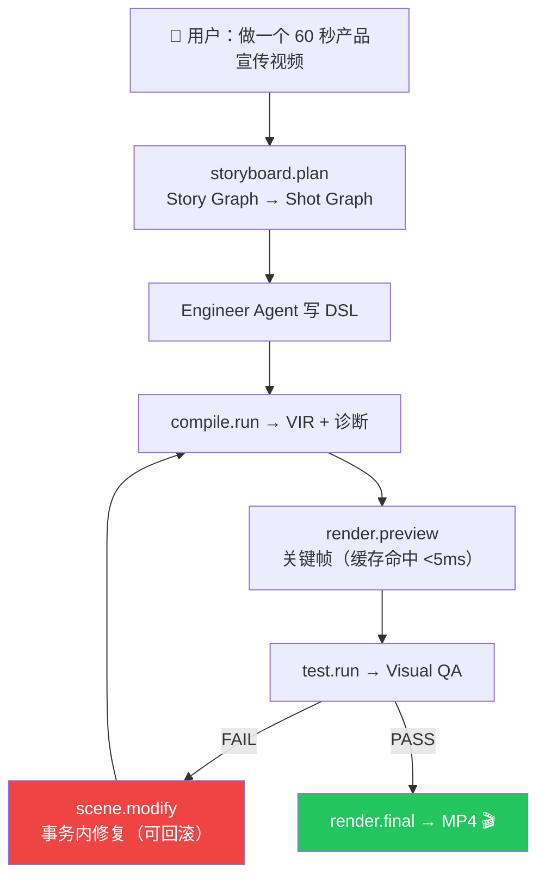
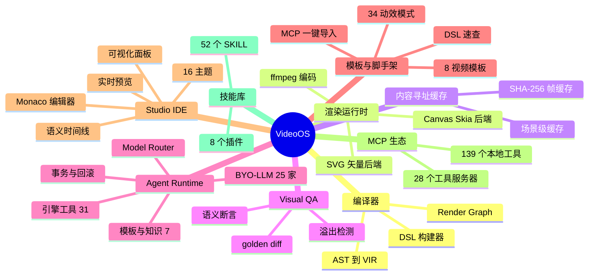
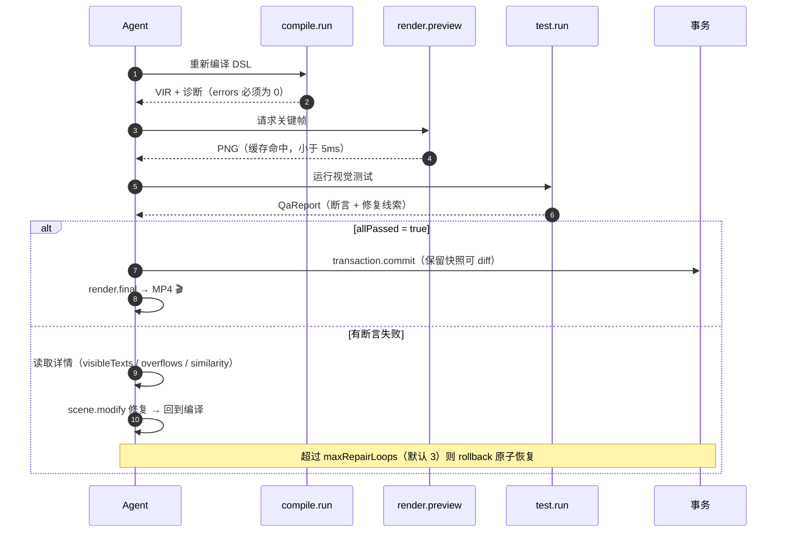
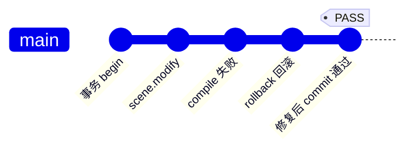
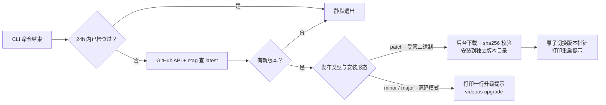
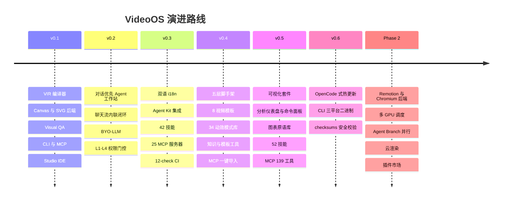

<a id="readme-top"></a>
<div align="center">


# 🎬 VideoOS

### The Agent-Native Video IDE &amp; Compiler — 面向 AI Agent 的视频编程操作系统

**对话 → 规划 → DSL → VIR → Frames → Visual QA → MP4**

[](https://readme-typing-svg.demolab.com)

<!-- 生命周期徽章 -->

[![][ci-badge]][ci-link]
[![][release-badge]][release-link]
[![][license-badge]][license-link]
[![][platform-badge]](#desktop)
[![][status-badge]](#roadmap)

<br/>

<!-- 社区徽章 -->

[![][stars-badge]][stars-link]
[![][forks-badge]][forks-link]
[![][issues-badge]][issues-link]
[![][prs-badge]][prs-link]
[![][contributors-badge]][contributors-link]
[![][pr-welcome-badge]][prs-link]

<br/>

<!-- 元数据徽章 -->

[![][last-commit-badge]][commits-link]
[![][commit-activity-badge]][commits-link]
[![][code-size-badge]][code-link]
[![][lang-top-badge]][code-link]
[![][visitors-badge]][profile-link]

**一句话看懂**

> **VideoOS 不是「AI + 视频编辑器」，而是一个新的软件类别：对话优先的 Agent 视频工作站。**
>
> 对 Agent 说「做一个 30 秒产品介绍视频」→ 全自动 **规划 → 写码 → 编译 → 预览 → QA → 渲染**，聊天流内联每一步；
> v0.5 可视化套件：**分析仪表盘**（图层构成/复杂度/调色板/最近活动）· **系统健康面板**（内存双环/MCP/Skills/渲染实时）· **Ctrl+K 命令面板**（编译/渲染/16 主题即选/视图跳转）· **快捷键帮助** · **播放器键盘控制**（Space/←→/L/B）· 图表原语库（10 种 SVG 图表，主题令牌自动适配）；
> v0.5 · 16 主题 · BYO-LLM 25 家 51 模型 · **38 Agent 工具**（31 VAP 引擎 + 4 知识 + 3 模板）· **五层脚手架**（8 视频模板 · 34 动效模式库 · 技能配方注入 · DSL 速查 · MCP 28 服务器 139 工具一键导入）· **52 技能** · 1,015 键中英双语 · L1-L4 权限门控 · 五页签可视化面板——让普通模型也能产出 Opus 级代码视频；IDE 保留为高级模式。

<p>
<b>简体中文</b>（当前） ·
<a href="docs/getting-started.md">English Guide</a> ·
<a href="SPEC.md">SPEC</a> ·
<a href="agent-kit/SPEC.md">Agent Kit SPEC</a>
</p>

<p>
<a href="#quickstart">Quick Start</a> •
<a href="#features">Features</a> •
<a href="#architecture">Architecture</a> •
<a href="#dsl">DSL</a> •
<a href="#skills">Skills</a> •
<a href="#hot-update">Hot Update</a> •
<a href="#faq">FAQ</a> •
<a href="#roadmap">Roadmap</a>
</p>


<kbd>TypeScript</kbd> <kbd>bun</kbd> <kbd>React</kbd> <kbd>Electron</kbd> <kbd>Monaco</kbd> <kbd>ffmpeg</kbd> <kbd>MCP</kbd> <kbd>Zod</kbd>

[](#architecture)

**v0.5.0** · 46 packages · 77,200 lines of TypeScript · 1,361 tests green

</div>

---

<details open>
<summary><kbd>📑 目录 / Table of Contents</kbd></summary>

<br/>

| 章节 | 入口 | 章节 | 入口 |
| --- | --- | --- | --- |
| 🔭 一眼看懂 | [Overview](#overview) | 🖥 Studio IDE | [Studio](#studio) |
| 💡 为什么是 VideoOS | [Why](#why) | ⌨️ CLI 参考 | [CLI](#cli) |
| ✨ 核心特性 | [Features](#features) | 🤖 Agent 生态 | [Skills](#skills) |
| 🆚 与现有方案对比 | [Comparison](#comparison) | 🔄 热更新 | [Hot Update](#hot-update) |
| 🚀 Quick Start | [Quick Start](#quickstart) | 📦 桌面应用 | [Desktop](#desktop) |
| 🧠 Agent 闭环 | [Agent Loop](#agent-loop) | ✅ 测试与质量 | [Quality](#quality) |
| 🏗 架构 | [Architecture](#architecture) | 🗺 Roadmap | [Roadmap](#roadmap) |
| 📖 使用手册 · Video DSL | [DSL](#dsl) | 🤝 贡献指南 | [Contributing](#contributing) |
| 🧬 VIR | [VIR](#vir) | 🌟 社区与支持 | [Community](#community) |
| 🧪 Visual QA | [Visual QA](#visual-qa) | ❓ FAQ | [FAQ](#faq) |
| ⚡ 增量渲染与缓存 | [Cache](#cache) | 📄 License | [License](#license) |
| ↩️ 事务系统 | [Transactions](#transactions) | 🎬 示例项目走读 | [Examples](#examples) |
| 🩺 故障排查速查 | [Troubleshooting](#troubleshooting) | 📚 文档地图 | [Docs Map](#docs-map) |

</details>

---
## <a id="overview"></a>🔭 一眼看懂

VideoOS 由六块基石构成——前两块是「视频第一次成为软件」的底气，后两块是「Agent 第一次安全干活」的保险，最后两块是「人机协作」的体验层。

### 🏛 三大核心资产

<table>
<tr>
<td align="center" width="33%">

🧬

**VIR — Video Intermediate Representation**

自研视频中间表示：DSL → AST → VIR → Render Graph<br/>
纯 JSON · 机器可读 · 可 diff · `virVersion` 独立版本化<br/>
语义时间线（场景/节拍命名，而非帧号）· 多后端中立

</td>
<td align="center" width="33%">

🧪

**Visual Unit Test**

视频第一次拥有 CI：<br/>
`expect(frame(30)).toContainText("VideoOS")`<br/>
语义断言免 OCR · 像素 golden diff · 溢出检测 · 回归保护<br/>
失败详情自带修复线索（`visibleTexts` / `overflows` / diff PNG）

</td>
<td align="center" width="33%">

🤖

**Agent Runtime**

BYO-LLM 25 家 51 模型 · Model Router · Agent 工具面 38（31 VAP 引擎 + 4 知识 + 3 模板）<br/>
Agent 图（Director / Storyboard / Engineer / QA / Repair）<br/>
事务式修改（begin → commit / **rollback**）· L1-L4 权限门控

</td>
</tr>
</table>

### 🧰 三大体验支柱

<table>
<tr>
<td align="center" width="33%">

💬

**对话优先（Chat-First）**

首启两屏向导（选主题 → 配模型）后，主界面就是一个对话框：<br/>
任务卡 / DSL 代码 / 预览帧 / QA 结果 / MP4 全部内联聊天流<br/>
IDE（Monaco / 时间线 / QA 面板）保留为高级模式

</td>
<td align="center" width="33%">

↩️

**事务系统**

Agent 的每一次多步修改都在事务里：<br/>
`transaction.begin` → 快照 → N 次编辑+编译+测试 → `commit` / `rollback`<br/>
**Agent 改坏项目自动回滚，告别 `git checkout`**

</td>
<td align="center" width="33%">

🌐

**中英双语**

Studio 全界面 zh / en 即时切换，零刷新<br/>
每语言 **1,015 键**，词典键位奇偶校验直接进 CI 门禁<br/>
LLM 回复语言对齐 · 错误码双语映射

</td>
</tr>
</table>

**核心公式**（[SPEC §0.2](SPEC.md)）：

```text
Creative Intent
  → Story Graph → Shot Graph          (Storyboard IR)
  → Video Program (DSL)               (Agent 写代码)
  → Video AST → VIR                   (编译器)
  → Render Graph                      (执行计划)
  → Render Runtime                    (Canvas / SVG / Remotion / FFmpeg)
  → Frame Cache                       (内容寻址缓存)
  → Visual QA                         (帧测试 / golden diff / 语义断言)
  → PASS → Export / FAIL → Agent Fix ↺
```

一行流：**Agent 写视频代码（DSL）→ VIR → Render Graph → 帧缓存（改一处只重渲受影响帧）→ 视觉单元测试 → FAIL 自动修复（可回滚）/ PASS 导出 MP4**

> [!IMPORTANT]
> **Agent 不直接「操纵视频」。** Agent 编写/修改视频程序 → VideoOS 编译 → 渲染 → QA 判定 → Agent 根据结果继续修改。代码是 source of truth，一切产物（帧、图、MP4）都可从代码 + 缓存确定性重建。

---

## <a id="why"></a>💡 Why VideoOS？

如果你写过视频脚本、维护过模板工程、或者被「改一个标题重渲三小时」折磨过，下面六条痛点你应该都认识得：

### 1. 视频创作 vs 视频编程

<table>
<tr>
<td width="50%">

😤 **传统视频创作的日常**

- 模板工程：改一处文案，人工检查全片有没有被挤爆
- 换个分辨率 / 竖屏版本：重新排版一整天
- 上线前回归：逐帧肉眼检查，漏看了就是事故
- 效果改了：整片重渲，渲错了再来一次
- Agent 想帮忙：只能在时间线上乱拖，改坏了找不回来
- 沟通成本：需求 → 分镜 → 制作 → 修改，每一步都在丢信息

</td>
<td width="50%">

😄 **VideoOS 的视频编程日常**

- 改一处文案：`videoos test` 一条命令回归全片断言
- 换个分辨率 / 竖屏版本：改 `meta.width/height`，编译器重排
- 上线前回归：QA 套件 + golden diff 进 CI，机器替你盯
- 效果改了：内容寻址缓存命中，只重渲受影响帧
- Agent 想帮忙：事务内修改，QA 不过自动 `rollback`
- 沟通成本：需求 → 对话 → DSL 代码，代码即契约

</td>
</tr>
</table>

### 2. 六个痛点，六个解法

| # | 😤 痛点 | 😄 VideoOS 解法 |
| --- | --- | --- |
| 1 | **模板锁定**——Pr/AE 模板工程离不开原作者，换个手就散架 | **代码即视频**：视频是一个 TypeScript 程序，git 管、diff 管、review 管 |
| 2 | **改标题重渲整片**——任何小改动都是全片重算 | **内容寻址缓存**：帧 key = SHA-256(virHash + backend + frame + size)，只重渲受影响帧 |
| 3 | **无法回归测试**——「上次明明是好的」是视频行业口头禅 | **Visual Unit Test**：语义断言 + 像素 golden diff，1,361 个测试在 VideoOS 自己的 CI 里跑 |
| 4 | **Agent 没有抓手**——LLM 生成不了二进制工程文件，只能在 JSON 里碰运气 | **DSL + VIR + 31 个 VAP 工具**：Agent 写代码、调工具、看诊断，闭环原生成立 |
| 5 | **Agent 改坏了怎么办**——自动化的前提是可恢复 | **事务系统**：snapshot → 编辑 → commit/rollback，坏修改原子恢复 |
| 6 | **工具链割裂**——剪辑软件、代码编辑器、渲染农场、CI 各管一段 | **一个 monorepo**：编译器、渲染、缓存、QA、Agent、IDE、桌面端全在一条管线里 |

---

## <a id="features"></a>✨ 核心特性

| 特性 | 说明 | 深入 |
| --- | --- | --- |
| 🧬 **Video DSL** | TypeScript 声明式视频编程：`v.scene().text().enter().camera()`；10 个命名效果 · 11 种缓动 · 4 种相机 · 3 种转场，位置支持百分比 | [DSL 手册](#dsl) · [dsl-reference](docs/dsl-reference.md) |
| 📐 **VIR** | 机器可读、可 diff 的视频中间表示；语义时间线（场景/节拍/图层命名而非帧号）；`virVersion` 独立于包版本 | [VIR 章节](#vir) · [SPEC §2](SPEC.md) |
| ⚡ **增量渲染** | Render Graph + 内容寻址帧缓存（SHA-256）：改一个标题不再重渲整片；二次 render 接近瞬时，缓存命中 `<5ms` | [缓存章节](#cache) |
| 🧪 **Visual Test** | 视频单元测试框架：语义断言免 OCR（`toContainText`）+ 像素 golden diff（`toMatchGolden`）+ `noTextOverflow` / `toBeBlack` / 亮度区间 / 帧间相似 | [Visual QA](#visual-qa) · [qa-guide](docs/qa-guide.md) |
| 🔍 **Visual Debugger** | 帧元素包围盒 · 溢出红框 · 图层 → 源码定位 · `inspect.frame` / `diff.frames` | [Studio](#studio) |
| 🤖 **Agent Runtime** | 25 家模型供应商可插拔（OpenAI 兼容 / Anthropic / Google / Azure / Manual）· Model Router 按任务路由 · Agent 图 + 三层 Memory（Working / Project / Failure） | [BYO-LLM](#byo-llm) |
| 🛠 **VAP 工具协议** | 31 个结构化引擎工具：compile 3 · storyboard 2 · scene/layer 5 · asset/audio 4 · render/cache 7 · test 2 · transaction 4 · diagnose 4；JSON Schema 校验 + 审计事件；另有对话层工具 7（模板 3 + 知识 4）→ Agent 工具面共 38 | [VAP 清单](#agent-loop) · [mcp-guide](docs/mcp-guide.md) |
| 🧰 **五层脚手架**（v0.4） | **8 视频模板**（`template.apply` 直接得可跑成片）· **34 动效模式库**（`pattern.search` 抄可编译片段）· 技能配方注入 · DSL 分主题速查 · MCP 28 服务器一键导入——让普通模型也能产出高质量代码视频 | [Agent 生态](#skills) |
| 📊 **可视化套件**（v0.5） | 分析仪表盘（图层/复杂度/调色板/活动）· 系统健康面板（内存双环/MCP/Skills/渲染）· Ctrl+K 命令面板 · 播放器键盘控制（Space/←→/L/B）· 10 种 SVG 图表原语（主题令牌自动适配） | [Studio](#studio) · [图表 MCP](#mcp-servers) |
| 🔌 **MCP 原生** | 主服务器 `videoos mcp`（stdio JSON-RPC 2.0）把 31 个 VAP 工具暴露给 Claude Desktop / Codex / Cursor；另有 28 个本地工具服务器 · **139 个工具** | [MCP 生态](#mcp-servers) · [mcp-guide](docs/mcp-guide.md) |
| ↩️ **事务系统** | `transaction.begin` → 快照 → N 次修改+编译+测试 → `commit`（保留可 diff）/ `rollback`（原子恢复）；Agent 改坏项目自动回滚 | [事务系统](#transactions) |
| 🖥 **Studio IDE** | Monaco 编辑器 + 实时预览 + 语义时间线 + Agent 面板 + 渲染监视器 + 诊断/QA/事件面板；本地 server `127.0.0.1:4747` | [Studio](#studio) · [studio-guide](docs/studio-guide.md) |
| 💬 **对话优先界面** | 首启向导 2 屏（主题 → 模型）→ 对话框主界面：任务卡 / 代码 / 预览帧 / QA / MP4 内联聊天流；L1-L4 权限门控 | [对话优先](#chat-first) |
| 🎨 **16 主题** | 9 暗 + 7 亮（默认 深空 Midnight），首启向导可视化选择，CSS variables 全局生效 | [主题表](#themes) |
| 🌐 **中英双语** | Studio 全界面 zh/en 即时切换；每语言 1,015 键，词典奇偶校验进 CI；LLM 回复语言对齐 · 错误码双语映射 | [i18n.md](docs/i18n.md) |
| 🤹 **52 技能** | 营销叙事 10 · 音乐歌词 3 · 信息图表 20（含 v0.5 可视化套件 10 招）· 教学讲解 6 · 品牌风格 5 · 工程工具 8；SKILL.md 契约 + 校验器 52/52 PASS | [技能库](#skills) · [skills.md](docs/agent-kit/skills.md) |
| 🧩 **8 插件** | plugin-kit SDK：声明式 `plugin.json` manifest + 事件订阅 + 工具注册；starter 模板开箱可抄 | [插件](#plugins) · [plugins.md](docs/agent-kit/plugins.md) |
| 🖥 **Windows 桌面** | Electron + NSIS 安装包，内置 bun 视频引擎 sidecar（`server.mjs` 全量 bundle） | [桌面应用](#desktop) |
| 🔄 **热更新** | v0.6 新增：`videoos upgrade` 全家桶 + 桌面 electron-updater + sha256 校验 + 版本目录回滚 | [热更新](#hot-update) |
| ✅ **12-check CI** | deps · typecheck×4 · lint · test×2 · build×3 · Windows 交叉检查；1,361 tests / 103 文件全绿 | [质量](#quality) |

---

## <a id="comparison"></a>🆚 与现有方案对比

VideoOS 不是 Remotion 的壳。Remotion、Blender、Chromium 在我们的架构里是**可插拔渲染后端**；真正的核心资产是自研的 **VIR / 编译器 / Render Graph / Visual QA / Agent Runtime**（[SPEC §0.3](SPEC.md)）。

| 维度 | **VideoOS** | Remotion | 剪映 / Pr 型编辑器 | 纯 ffmpeg 脚本 | AI 文生视频 |
| --- | --- | --- | --- | --- | --- |
| **视频的表示** | TypeScript DSL → 自研 VIR（JSON，可 diff） | React 组件树 | 二进制工程文件 / 时间线 | 命令行参数拼接 | 文本提示词 |
| **Agent 能直接写吗** | ✅ 原生闭环：31 个 VAP 工具 + 事务 + 诊断 | ⚠️ 能写 React，但没有视频级 IR 与 QA 闭环 | ❌ 时间线对 Agent 是黑盒 | ⚠️ 能拼命令，无结构化反馈 | ❌ 不可编程 |
| **单元测试** | ✅ 语义断言 + golden diff，`videoos test` 一键回归 | ⚠️ 可截图比对，无语义断言层 | ❌ 人工逐帧肉眼检查 | ❌ 无 | ❌ 无 |
| **增量渲染** | ✅ Render Graph + SHA-256 内容寻址帧缓存 | ⚠️ 帧级缓存有限 | ❌ 全片重渲 | ❌ 全片重渲 | — 每次重新生成 |
| **可复现性** | ✅ 确定性契约：同 DSL → 同 VIR → 同像素 | ⚠️ 依赖 React 渲染环境 | ❌ 人工操作不可复现 | ⚠️ 依赖脚本纪律 | ❌ 每次结果不同 |
| **改一处的影响面** | 只重渲受影响帧 | 视 React 组件粒度 | 整片重渲 | 整片重渲 | 整片重生成 |
| **回滚坏修改** | ✅ 事务系统 begin/commit/rollback | git（代码级） | 手动 Ctrl+Z / 工程备份 | git（脚本级） | 无法回滚 |
| **定位** | Agent 原生视频 IDE + 编译器 | React 程序员的视频框架 | 人类创作者的剪辑工具 | 编码/封装瑞士军刀 | 生成式素材源 |

> [!TIP]
> **它们不是竞品，是生态位。** Remotion 是优秀的 React 视频框架（Phase 2 会成为 VideoOS 的可选渲染后端）；剪映服务人类剪辑师；ffmpeg 是我们的编码层；AI 文生视频产出的是**素材**，VideoOS 产出的是**程序**——程序可以被测试、被 diff、被 Agent 无限次安全修改。

### <a id="technology-stack"></a>🧰 技术栈

| 层 | 选型 | 用在哪 |
| --- | --- | --- |
| 语言 / 运行时 | **TypeScript** + **bun 1.3**（workspace monorepo，锁定 1.3.14） | 全仓 77,200 行 TS/TSX；CLI 直跑 `.ts` 入口 |
| 渲染 | **@napi-rs/canvas**（Skia）+ 自研 SVG 后端 | `render-canvas` 参考后端 / `render-svg` 矢量后端 |
| 编码 | **ffmpeg**（h264 / vp9）+ PNG 序列回退 | `encode` 包；`FFMPEG_PATH` 显式覆盖、失败响亮 |
| 校验 | **Zod** | VIR schema、VAP/MCP 全部入参校验、plugin-kit `ctx.z` |
| IDE | **Monaco 0.52** + React 18 + Vite 6 + Zustand 5 | Studio：类型注入自动补全、保存即编译 |
| 桌面 | **Electron 33** + electron-builder 25（NSIS）+ esbuild | Windows 壳 + bun sidecar 引擎 |
| 服务 | **Hono** + @hono/node-server + ws | 本地 REST（56 路由）+ WebSocket `/ws` |
| 协议 | **MCP**（stdio JSON-RPC 2.0，协议版 `2025-03-26` / `2024-11-05`） | 主服务器 31 VAP 工具 + 28 个本地工具服务器 |
| CLI | **commander** + tsup | `videoos` 12 命令（v0.6 新增 `upgrade`） |
| 质量 | bun test · tsc ×4 · ESLint 9（扁平配置） | 12-check CI，1,361 tests |

---
## <a id="quickstart"></a>🚀 Quick Start

三条路径任选其一：**桌面安装**（零依赖开箱即用）、**源码运行**（完整开发体验）、**MCP 接入**（把 VideoOS 变成你现有 Agent 的工具）。

<table>
<tr>
<td width="33%" align="center">

**🪟 Windows 桌面**

下载 NSIS 安装包<br/>双击安装，内置视频引擎<br/>
**5 分钟 · 零依赖**

</td>
<td width="33%" align="center">

**⌨️ 源码运行**

git clone + bun install<br/>全平台 · 完整 CLI + Studio<br/>
**10 分钟 · 开发者推荐**

</td>
<td width="33%" align="center">

**🔌 MCP 接入**

Claude Desktop / Codex / Cursor<br/>直连你的视频项目<br/>
**2 分钟 · 已有 Agent 用户**

</td>
</tr>
</table>

### 方式一 · Windows 桌面应用（推荐给创作者）

从 [**Releases**](https://github.com/AceGuru-mjh/VideoOS/releases) 下载安装包：

| 产物 | 说明 |
| --- | --- |
| `VideoOS-Studio-Setup-<version>.exe` | NSIS 安装器（x64）：Studio IDE + Agent 对话界面 + bun 视频引擎 sidecar |
| `latest.yml` | electron-updater 更新元数据（v0.6 起桌面端自动检查更新） |

**系统要求与内置引擎：**

- ✅ 安装包**内置 bun 1.3 视频引擎**（sidecar 全量 bundle，无需另装 bun / Node）
- ✅ 编译、预览、Visual QA、Agent 对话**全部不需要 ffmpeg**
- ⚠️ 仅**最终导出 MP4** 需要系统 ffmpeg——缺失时界面会给出安装指引（见 [Troubleshooting](docs/troubleshooting.md)），或：

```bash
winget install ffmpeg    # 管理员 PowerShell，装完重开终端
```

安装完成后的路径：首次启动 → 选主题（16 选 1）→ 配置模型（BYO-LLM，25 家任选，需 API Key）→ 对话框里直接说「做一个 30 秒产品介绍视频」。

> [!TIP]
> 只想对话式创作、不想碰代码？桌面版就是为你准备的——IDE（Monaco / 时间线 / QA 面板）作为高级模式保留在侧栏，随时切换。


### 方式二 · 源码运行（bun ≥ 1.3，全平台）

VideoOS 是一个 bun workspace monorepo。你需要 [bun](https://bun.sh) ≥ 1.3 与 git：

```bash
# 1) 克隆与安装（1,057 个包，首次约 20s）
git clone https://github.com/AceGuru-mjh/VideoOS && cd VideoOS
bun install

# 2) 设置别名——下文所有命令直接用 videoos（也可以 bun run --filter @videoos/cli build 后加入 PATH）
alias videoos="bun $(pwd)/apps/cli/src/index.ts"
```

<details>
<summary><kbd>📦 Windows PowerShell 用户点这里</kbd></summary>

<br/>

```powershell
git clone https://github.com/AceGuru-mjh/VideoOS; cd VideoOS
bun install

# PowerShell 函数别名（写入 $PROFILE 持久化）
function videoos { bun "$HOME/repos/VideoOS/apps/cli/src/index.ts" @args }
```

Windows 路径含空格时记得加引号；`--project` 参数支持 `D:\videos\demo` 形式。

</details>

**从零到第一个 MP4：**

```bash
# 3) 创建第一个视频项目（模板含两场景示例 + QA 套件，6.0s · 1920×1080 · 30fps）
videoos init my-video && cd my-video

# 4) 编译：DSL → VIR（.video/vir.json + graph.json + diagnostics.json）
videoos compile
```

```text
场景（2）：
  name     duration   frames   beats
  intro    3.50s     105      title-enter, subtitle-enter
  outro    3.00s     90       repo-show
  合计：6.00s / 180 帧 / 1920×1080 @ 30fps

✓ 诊断：无（0 error / 0 warning）
VIR → my-video/.video/vir.json
```

```bash
# 5) 视觉单元测试（语义断言 + golden diff；不需要 ffmpeg）
videoos test
# ✓ 3 passed / 0 failed — 视频第一次拥有 CI

# 6) 渲染最终视频（逐帧 canvas → 帧缓存 → ffmpeg 编码）
videoos render
# → .video/renders/render-<virhash>.mp4（二次渲染接近瞬时：全缓存命中）

# 7) 打开 Studio IDE（本地 server + 浏览器，127.0.0.1:4747）
videoos preview

# 8) 环境体检：运行时 / ffmpeg / zod+canvas / 项目 compile 冒烟 / providers / 技能库 / MCP 宿主
videoos doctor

# 9) 浏览 52 个创作技能（对话中 Agent 会按 trigger 自动触发）
videoos skills list
videoos skills search lyrics
videoos skills show tech-intro
```

> [!NOTE]
> 除了最终 MP4 编码，**其他一切（编译 / 预览 / QA / Agent）都不需要 ffmpeg**。`videoos doctor` 会逐项体检并内联打印修复建议。

#### 写第一个场景 · `src/video.ts`

```ts
import { defineVideo } from "@videoos/dsl";

export default defineVideo({ title: "Hello", width: 1920, height: 1080, fps: 30 }, (v) => {
  v.scene("intro", { duration: 4 }, (s) => {
    s.beat("title-enter", { at: 0.2 });
    s.text("title", "Hello VideoOS", {
      size: 120, color: "#fff", at: { x: "50%", y: "45%" },
      enter: { effect: "blur-up", duration: 0.8 },
    });
    s.camera("push-in", { from: 1, to: 1.08 });
  });
});
```

#### 写第一个视觉测试 · `tests/video.test.ts`

```ts
import { describe, it, expect, frame } from "@videoos/qa";

describe("intro", () => {
  it("标题在 1 秒可见", () => expect(frame(30)).toContainText("Hello VideoOS"));
  it("无黑帧", () => expect(frame(0)).not.toBeBlack());
});
```

同一个文件在两种模式下都能跑：`videoos test`（QA runner）与 `bun test`（bun:test 包装器）——测试与 CI 无缝衔接。

<details>
<summary><kbd>🔍 生成项目长什么样？（项目解剖）</kbd></summary>

<br/>

```text
my-video/
├── video.project.json     # manifest：name / entry / engines / render / agent
├── src/
│   ├── video.ts           # DSL 入口 — export default defineVideo(...)
│   └── scenes/            # 可选的场景子模块
├── assets/
│   ├── images/  ├── audio/  └── fonts/   # 字体按文件名注册（family = 文件名去扩展名）
├── tests/
│   ├── video.test.ts      # Visual QA 套件（@videoos/qa）
│   └── golden/            # golden 基线 PNG（--update-golden 生成）
└── .video/                # 生成物 — 可安全 gitignore
    ├── vir.json           # 编译产物 VIR（机器可读、可 diff）
    ├── graph.json
    ├── cache/             # 内容寻址帧缓存
    ├── renders/           # 最终 MP4/WebM
    ├── snapshots/         # 事务快照（Agent 回滚用）
    ├── diagnostics/       # 编译诊断 + Agent 预览帧
    └── memory/            # Agent 项目/失败记忆
```

| `video.project.json` 字段 | 含义 |
| --- | --- |
| `name` | 项目名（Studio / CLI 显示） |
| `entry` | DSL 入口相对路径，默认 `src/video.ts` |
| `engines.videoos` | 引擎约束，当前 `^0.1` |
| `render` | `{ defaultBackend: "canvas", encoder: "ffmpeg" }` |
| `agent` | `{ autonomous: true, maxRepairLoops: 3 }` |

</details>

### 方式三 · MCP 接入：让外部 Agent 直接操作你的视频项目

`videoos mcp` 启动一个 stdio JSON-RPC 2.0 服务器，把 31 个 VAP 工具全部暴露给任何 MCP 客户端（Claude Desktop / Claude Code / Codex / Cursor……）。

**Claude Desktop** · `claude_desktop_config.json`：

```jsonc
{
  "mcpServers": {
    "videoos": {
      "command": "videoos",
      "args": ["mcp", "--project", "D:\\videos\\demo"]
    }
  }
}
```

**Claude Code** · 项目根 `.mcp.json`（推荐 `args + cwd` 形态）：

```jsonc
{
  "mcpServers": {
    "videoos": { "command": "videoos", "args": ["mcp"], "cwd": "/absolute/path/to/my-video" }
  }
}
```

**Cursor** · `~/.cursor/mcp.json`：

```jsonc
{
  "mcpServers": {
    "videoos": { "command": "videoos", "args": ["mcp", "--project", "/absolute/path/to/my-video"] }
  }
}
```

> [!WARNING]
> 两个易踩的坑：
> ① `videoos mcp` **需要项目上下文**（存在 `video.project.json` 的目录）——用 `--project <path>` 指定，或让客户端 `cwd` 落在项目根；
> ② Windows 的 JSON 路径要双反斜杠（`D:\\videos\\demo`），macOS/Linux 用 `/Users/you/videos/demo`。
> 完整排障表见 [MCP 连接问题](docs/troubleshooting.md)。

接入后在 Claude 里说「帮我把 CTA 场景标题改成 Ship it，跑一遍测试再渲染」——Agent 会经 `compile.run` → `scene.modify`（事务内）→ `test.run` → `render.final` 完成闭环，Studio 可以同时开着作为可视化地面真值（文件变更自动热编译）。

### 🔄 热更新速览（v0.6 新增）

```bash
videoos upgrade --check    # 当前 0.5.0 → 最新 0.6.0（受管二进制 · 功能更新）
videoos upgrade            # 检查并升级；源码模式提示 git pull
videoos upgrade --rollback # 反悔了？一条命令回滚上一版本
```

命令结束后会做节流后台检查（≤1 次/24h）发现新版只打一行提示，绝不打扰你的工作流——详见 [热更新章节](#hot-update)。

---
## <a id="examples"></a>🎬 示例项目走读

仓库自带 **4 个可直接运行的示例项目**——每一个都是完整工程（manifest + 入口 + QA 套件），零资产、全确定性（固定 seed、无未播种随机、无时钟读取），可以原样打开、测试、渲染：

| 示例 | 规格 | 展示什么 | 走读 |
| --- | --- | --- | --- |
| [product-promo](examples/product-promo/README.md) | 11.0s · 1920×1080 · 330 帧 | 3 场景：blur-up 标题 + push-in 相机 · slide-up 逐项 stagger · crossfade CTA | [↓](#example-product-promo) |
| [data-story](examples/data-story/README.md) | 9.0s · 1280×720 | 4 柱不同 easing 生长（slide-up + 遮罩 rect 技巧）· 无图表库 | [↓](#example-data-story) |
| [kinetic-typography](examples/kinetic-typography/README.md) | 7.6s · 1280×720 | typewriter 切片语义 · 全方向 move（up/left/right + scale-pop） | [↓](#example-kinetic) |
| [code-walkthrough](examples/code-walkthrough/README.md) | 9.0s · 1280×720 | rect/ellipse/text 画终端窗口 · 5 行打字机错峰 CLI 会话 | [↓](#example-code) |

```bash
# 任一示例：进入目录即是完整项目
cd examples/product-promo
videoos test        # 跑它的 QA 套件
videoos render      # 渲染出 MP4
videoos preview     # 在 Studio 里打开
```

### <a id="example-product-promo"></a>1 · product-promo — 三场景发布宣传片

**时间轴数学**（fps 30 · 1920×1080，转场重叠使场景交叠）：

```text
title    [0.0s, 4.0s)   4.0s
features [3.5s, 8.5s)   5.0s   ← crossfade 0.5s 与 title 尾部重叠
cta      [8.0s, 11.0s)  3.0s   ← crossfade 0.5s 与 features 尾部重叠
total: 11.0s = 330 帧 —— 全确定性（seed 42，无时钟/未播种随机）
```

**核心 DSL**（完整代码见 [examples/product-promo/src/video.ts](examples/product-promo/src/video.ts)）：

```ts
export default defineVideo(
  { title: "VideoOS Product Promo", width: 1920, height: 1080, fps: 30,
    background: "#0a0a12", seed: 42 },
  (v) => {
    // ---- title：柔光 + blur-up 主标题 + push-in 相机
    v.scene("title", { duration: 4, background: "#0a0a12" }, (s) => {
      s.beat("title-enter", { at: 0.2, description: "Main title blur-up entrance" });
      s.beat("subtitle-enter", { at: 0.8, description: "Subtitle fades in below the title" });

      s.rect("glow", { width: 700, height: 700, fill: "#6d28d9", opacity: 0.25, blur: 120,
                      at: { x: "50%", y: "38%" } });   // 无 enter → 第 0 帧可见

      s.text("title", "SHIP VIDEO", {
        size: 140, weight: 800, color: "#ffffff", letterSpacing: 6,
        at: { x: "50%", y: "38%" },
        enter: { effect: "blur-up", duration: 0.8, easing: "easeOutCubic",
                 params: { distance: 40, blur: 12 } },
      });

      s.text("subtitle", "The agent-native video runtime", {
        size: 44, color: "#8b8ba7", at: { x: "50%", y: "52%" },
        enter: { effect: "fade", duration: 0.6, delay: 0.4 },
      });

      s.camera("push-in", { from: 1.0, to: 1.08 });
    });

    // ---- features：标题 + 琥珀色强调线 + 三行卖点（stagger 0.3 / 0.9 / 1.5）
    v.scene("features", { duration: 5 }, (s) => {
      s.beat("list-enter", { at: 0.2, description: "Heading + accent line enter" });
      s.beat("item-two", { at: 0.9, description: "Second feature slides up" });
      s.beat("item-three", { at: 1.5, description: "Third feature slides up" });

      s.text("heading", "BUILT FOR AGENTS", {
        size: 76, weight: 800, color: "#ffffff", letterSpacing: 4,
        at: { x: "50%", y: "24%" },
        enter: { effect: "blur-in", duration: 0.6 },
      });

      s.rect("accent", { width: 240, height: 6, fill: "#f59e0b", radius: 3,
                         at: { x: "50%", y: "31%" },
                         enter: { effect: "fade", duration: 0.5, delay: 0.2 } });

      const items = [
        ["item-1", "01 · Deterministic pipeline", 0.3],
        ["item-2", "02 · Visual QA on every frame", 0.9],
        ["item-3", "03 · Rollback-safe agent edits", 1.5],
      ] as const;
      for (const [name, text, delay] of items) {
        s.text(name, text, {
          size: 46, weight: 600, color: "#e2e8f0", at: { x: "50%", y: `${44 + items.findIndex(i => i[0] === name) * 12}%` },
          enter: { effect: "slide-up", duration: 0.6, delay, easing: "easeOutCubic",
                   params: { distance: 60 } },
        });
      }
    });

    // ---- cta：双行 fade 收尾
    v.scene("cta", { duration: 3 }, (s) => {
      s.beat("cta-enter", { at: 0.2, description: "Call-to-action headline fades in" });
      s.beat("url-enter", { at: 0.9, description: "Repository URL fades in" });
      s.text("cta", "Start shipping today", {
        size: 88, weight: 800, color: "#ffffff", at: { x: "50%", y: "44%" },
        enter: { effect: "fade", duration: 0.8, delay: 0.2 },
      });
      s.text("url", "github.com/AceGuru-mjh/VideoOS", {
        size: 44, color: "#8b8ba7", at: { x: "50%", y: "58%" },
        enter: { effect: "fade", duration: 0.6, delay: 0.8 },
      });
    });

    // 转场只允许相邻场景对；duration 必须短于两侧场景
    v.transition("crossfade", { duration: 0.5, between: ["title", "features"] });
    v.transition("crossfade", { duration: 0.5, between: ["features", "cta"] });
  },
);
```

**读代码时注意三个模式**：① `glow` 无 enter 动画 → 第 0 帧可见（保 `not.toBeBlack` 通过）；② stagger 靠同效果 + 递增 delay，不是关键帧；③ 每个叙事事件都有 beat 名字——QA 与时间线都靠它说话。

### <a id="example-kinetic"></a>2 · kinetic-typography — 打字机与四向位移

**时间轴**：`typewriter [0.0s, 4.0s)` + `moves [3.6s, 7.6s)`，crossfade 0.4s 交叠，合计 7.6s = 228 帧。

```ts
v.scene("typewriter", { duration: 4, background: "#0a0a12" }, (s) => {
  s.beat("type-start", { at: 0.2, description: "First typewriter line starts" });
  s.beat("line-2-start", { at: 1.7, description: "Second typewriter line starts" });

  // 暖色光晕：第 0 帧可见，文字打字期间画面不黑
  s.ellipse("glow", { width: 420, height: 420, fill: "#f59e0b", opacity: 0.22, blur: 80,
                      at: { x: "50%", y: "35%" } });

  s.text("line-1", "TYPE IS MOTION.", {
    size: 60, weight: 700, font: "monospace", color: "#ffffff", letterSpacing: 2,
    at: { x: "50%", y: "52%" },
    enter: { effect: "typewriter", duration: 1.5, easing: "linear" },
  });

  // 第二行等第一行打完再开始（delay 1.6s）
  s.text("line-2", "Every character lands on a beat.", {
    size: 38, font: "monospace", color: "#8b8ba7", at: { x: "50%", y: "66%" },
    enter: { effect: "typewriter", duration: 1.6, delay: 1.6, easing: "easeOutCubic" },
  });
});
```

**它的 QA 套件是「打字机语义」的活教材**（节选自 [tests/video.test.ts](examples/kinetic-typography/tests/video.test.ts)）：

```ts
describe("typewriter", () => {
  it("does not start on a black frame (glow visible from frame 0)", () => {
    expect(frame(0)).not.toBeBlack();
  });

  it("has not typed the full first line at frame 0 (typewriter slices content)", () => {
    expect(frame(0)).not.toContainText("TYPE IS MOTION.");   // ← 只打了前缀
  });

  it("shows the full first line after typing completes (frame 60 = local 2.0s > 1.5s)", () => {
    expect(frame(60)).toContainText("TYPE IS MOTION.");      // ← delay+duration 之后才断言全文
  });
});
```

**帧算术注释直接写在测试文件头部**（审核者可自行复算）：

```text
line-1 types 0.0 → 1.5s (complete) → asserted at frame 60  (local 2.0s)
line-2 types 1.6 → 3.2s (complete) → asserted at frame 105 (local 3.5s)
moves   pop 0.6 / slides to 2.0s   → asserted at frame 180 (moves local 2.4s)
```

### <a id="example-data-story"></a>3 · data-story — 零依赖动画柱状图

**时间轴**：`chart [0.0s, 6.5s)` + `takeaway [6.0s, 9.0s)`，crossfade 0.5s，合计 9.0s = 270 帧。

核心技巧（生长柱 = `slide-up` + 背景色遮罩，完整讲解见 [DSL 手册 · 片段 5](#dsl)）：每根柱子的 `distance = 自身高度`，t=0 时整体沉在基线以下；一张背景色 rect 声明在柱子**之后**（画家序后画在上层）盖住基线以下的部分——于是「从下方滑入」变成「从轴线生长」。四根柱子各用一种缓动：`linear` / `easeOutCubic` / `easeOutExpo` / `bounce`。

**QA 套件节选**——结构断言（零渲染）+ 落定帧断言的搭配：

```ts
describe("chart", () => {
  it("has the four bar rect layers", () => {
    expect(scene("chart")).toHaveLayers("bar-1", "bar-2", "bar-3", "bar-4");
  });

  it("has the axis furniture and labels", () => {
    expect(scene("chart")).toHaveLayers("mask", "axis", "value-1", "value-4", "day-1", "day-4");
  });

  it("keeps the bars-grow beat", () => {
    expect(scene("chart")).toHaveBeat("bars-grow");
  });

  it("fits the rhythm (6-7 seconds)", () => {
    expect(scene("chart")).durationBetween(6, 7);
  });

  // frame 105 = chart-local 3.5s：柱子（最晚 2.55s）与标签（最晚 3.3s）全部落定
  it("shows title and value labels after all animations complete (frame 105)", () => {
    expect(frame(105)).toContainText("RENDER HOURS SAVED PER WEEK");
    expect(frame(105)).toContainText("3.2");
    expect(frame(105)).toContainText("7.6");
  });

  it("has no overflowing text", () => {
    expect(scene("chart")).noTextOverflow();
  });
});
```

`takeaway` 场景是 `typewriter` 金句 + fade 副标题——**数值断言 + 节奏断言 + 溢出断言**三层防线把整个示例钉死。

### <a id="example-code"></a>4 · code-walkthrough — 画出来的终端窗口

**时间轴**：`terminal [0.0s, 6.5s)` + `caption [6.0s, 9.0s)`，crossfade 0.5s，合计 9.0s = 270 帧。

零截图零素材：终端窗口是 `rect`（窗体 + 标题栏）+ 三个 `ellipse`（红黄绿交通灯）+ `text`（标题）；CLI 会话是五行 monospace 文本，`typewriter` 错峰打字：

```ts
const LINES = [
  { name: "line-1", content: "$ videoos compile",                 y: 200, color: PROMPT, delay: 0.4, duration: 0.7 },
  { name: "line-2", content: "ok - 3 scenes, 330 frames, 0 errors", y: 260, color: OK,     delay: 1.3, duration: 1.2 },
  { name: "line-3", content: "$ videoos test",                    y: 320, color: PROMPT, delay: 2.8, duration: 0.6 },
  { name: "line-4", content: "ok - 12/12 assertions passed",      y: 380, color: OK,     delay: 3.7, duration: 1.0 },
  { name: "line-5", content: "$ videoos render",                  y: 440, color: PROMPT, delay: 5.0, duration: 0.8 },
];

for (const line of LINES) {
  s.text(line.name, line.content, {
    size: 26, font: "monospace", color: line.color, at: { x: 640, y: line.y },
    enter: { effect: "typewriter", duration: line.duration, delay: line.delay, easing: "easeOutCubic" },
  });
}
```

它展示了 **typewriter 的时序断言**（frame 90 = terminal-local 3.0s：前两行打完、第三行还没开始）：

```ts
it("shows compile input and output after they finish typing (frame 90)", () => {
  expect(frame(90)).toContainText("$ videoos compile");
  expect(frame(90)).toContainText("0 errors");
});

it("has NOT typed the test command yet at frame 90 (line-3 completes at local 3.4s)", () => {
  expect(frame(90)).not.toContainText("$ videoos test");
});
```

### 四个示例的共同契约

每个 `video.project.json` 都是同一形态：

```jsonc
{
  "name": "product-promo",
  "entry": "src/video.ts",
  "engines": { "videoos": "^0.1" },
  "render": { "defaultBackend": "canvas", "encoder": "ffmpeg" },
  "agent": { "autonomous": true, "maxRepairLoops": 3 }
}
```

这就是「视频项目」的全部约定：一个 manifest、一个 DSL 入口、一套 QA、一个 `.video/` 生成目录。**把它丢给任何一个 MCP 客户端，Agent 就能接着改。**

---
## <a id="agent-loop"></a>🧠 Agent 闭环

这是 VideoOS 存在的理由：**把「一句话 → 成片」变成一个可测试、可回滚、可审计的工程闭环。**

### 闭环全景



### 六步走完一个任务

| 步骤 | 阶段 | VAP 工具 | 输入 | 输出 |
| --- | --- | --- | --- | --- |
| 1 | **规划** | `storyboard.plan` → `storyboard.toScenes` | 创作意图 + 时长 + 风格 | Shot Graph（镜头表）→ 场景 DSL 代码草稿 |
| 2 | **写码** | Engineer Agent 写 `src/video.ts` | Shot Graph + 技能库（52 个 SKILL.md） | TypeScript DSL（人类可读、可 review） |
| 3 | **编译** | `compile.run` / `compile.diagnostics` / `compile.vir` | DSL 源码 | VIR + 诊断（error 必须为 0）+ Agent 的世界模型 |
| 4 | **预览** | `render.preview` / `render.range` | 帧号或 `scene + beat` | 关键帧 PNG（缓存命中 `<5ms`）→ `.video/diagnostics/` |
| 5 | **测试** | `test.run` / `test.results` | QA 套件 | `QaReport`：断言结果 + 修复线索（`visibleTexts` / `overflows` / diff） |
| 6 | **交付** | `render.final`（PASS）或 `scene.modify` 修复（FAIL） | 全片或单场景 | MP4 🎬 / 事务内回滚 |

**修复循环**：第 5 步 FAIL 时回到第 2 步，上限为 manifest 的 `agent.maxRepairLoops`（默认 3）；超限则 `transaction.rollback` 原子恢复并如实报告——**宁可失败也不交付坏视频**。

### <a id="chat-first"></a>聊天流里长什么样

在 Studio 的对话界面里，同一次任务会内联渲染成一张张任务卡与 artifact（v0.2 对话优先形态）：

```text
┌────────────────────────────────────────────────────────────────┐
│ 你：做一个 30 秒的 VideoOS 产品介绍视频，科技感，深色背景          │
├────────────────────────────────────────────────────────────────┤
│ 🧠 规划          storybook.plan → 6 shots          ✓ 1.2s      │
│    ├ hook：模糊上浮主标题 + push-in 相机（0-4s）                  │
│    ├ features：三行卖点逐项 slide-up（4-9s）                      │
│    └ cta：crossfade 收尾（9-11s）…                               │
│ ✍️ 写码          Engineer 写 DSL · 3 场景          ✓ 2.8s      │
│    └ artifact: src/video.ts（+42 行，点击展开 diff）              │
│ ⚙️ 编译          compile.run → 0 error / 0 warning  ✓ 0.4s      │
│ 👁 预览          render.preview × 6 帧 · 全部缓存命中  ✓ 0.3s   │
│    └ artifact: 预览帧 PNG 网格（标题帧 / 列表帧 / CTA 帧）         │
│ 🧪 测试          test.run → 11 pass / 1 fail       ⚠ 1.9s      │
│    └ artifact: 断言表 — 「CTA 标题在 fade 完成前被断言」           │
│ 🔧 修复          scene.modify（事务 #tx_01 内）     ✓ 0.6s      │
│    └ test.run → 12 pass / 0 fail · transaction.commit           │
│ 🎬 渲染          render.final → render-3f9c2a.mp4   ✓ 8.1s     │
│    └ artifact: MP4 内联播放器 · 1920×1080 · 330 帧               │
└────────────────────────────────────────────────────────────────┘
```

每一次工具调用（`tool-call` / `tool-result`）都会作为审计事件流式推送到 Studio 的 Agent 面板与 Events 面板——**Agent 做的每一步你都看得见**。

### L1-L4 权限门控

Agent 的自主性是分级旋钮，不是一个开关（设置中心 · Agent 与自主性）：

| 级别 | 名称 | 行为 | 适合 |
| --- | --- | --- | --- |
| **L1** | 全确认 | 每一次工具调用都在聊天流里等待你点头 | 初次使用 / 高风险项目 |
| **L2** | 读自动 | 只读工具（compile/inspect/test）自动执行，任何写操作需确认 | 日常创作 |
| **L3** | 危险确认 | 默认全自动；仅 `shell` 类与文件删除类工具需确认 | 信任的 Agent 工作流 |
| **L4** | 全自动 | 全部自动，仅靠危险命令黑名单与「渲染前确认」开关兜底 | 批量任务 / 无人值守 |

配套护栏：**31 个 VAP 工具 + MCP 工具逐项 allow / confirm / deny 权限矩阵**、最大迭代步数、危险命令黑名单、渲染前确认开关。

### 🛠 VAP 工具完整参考（31 个）

VAP（Video Agent Protocol）是所有 Agent 面共享的工具层：内置 Agent（`videoos agent exec`）、Studio Agent 面板、REST/WS server、MCP——**一个注册表，四种传输**。每个工具入参经 JSON Schema 校验，返回 `{ ok, data }` 或 `{ ok: false, error }`（错误串带 `SCENE_NOT_FOUND:` 这类前缀码），并发出 `tool-call` / `tool-result` 审计事件。

**Compile（3）**

| 工具 | 用途 | 关键参数 |
| --- | --- | --- |
| `compile.run` | 重载 `src/video.ts` → 编译 VIR / FramePlan / 诊断；写 `.video/vir.json` | — |
| `compile.diagnostics` | 上次编译的诊断（需要时自动编译一次） | — |
| `compile.vir` | 完整 VIR JSON + 每场景摘要（`name` / `duration` / `start` / `beats` / `layers`）——Agent 的世界模型 | — |

**Storyboard（2）**

| 工具 | 用途 | 关键参数 |
| --- | --- | --- |
| `storyboard.plan` | 意图 → 镜头表（`id` / `name` / `start` / `duration` / `purpose` / `keyElement`）。确定性模板：<8s → 4 镜、<20s → 5 镜、否则 6 镜；服务端可注入 LLM 生成器 | `intent` · `durationSeconds` · `style?` |
| `storyboard.toScenes` | 镜头 → DSL 代码串（每镜头一场景、文本图层、入场 beat、相邻 crossfade）。只返回代码，写不写由 Agent 决定 | `shots`（来自 `storyboard.plan`） |

**Scene / Layer 编辑（5）**

| 工具 | 用途 | 关键参数 |
| --- | --- | --- |
| `scene.list` | 场景摘要（名字/时长/起点/图层名/beat 名）+ totalFrames | — |
| `scene.inspect` | 单场景完整 VIR + 语义帧区间 + beat→帧映射 | `scene`（名或 id） |
| `scene.modify` | 源码锚定编辑（写回入口并重编译）：`replace_text` / `set_color` / `set_duration` / `set_animation` | `scene` · `operation` · `layer?` · `value` |
| `layer.inspect` | 图层 VIR + 其在场景中点的 FramePlan 命令 | `scene` · `layer` |
| `layer.modify` | 源码锚定属性编辑 + 重编译：`text` / `color` / `size` / `opacity` | `scene` · `layer` · `property` · `value` |

锚定失败返回 `PATTERN_NOT_FOUND`——正确动作是整文件重写（Engineer 姿态），不要反复重试同一编辑。

**Asset / Audio（4）**

| 工具 | 用途 | 关键参数 |
| --- | --- | --- |
| `asset.list` | 扫描 `assets/{images,audio,fonts}` + VIR 资产注册表 | — |
| `asset.add` | 写文件到 `assets/<kind-dir>/<path>`（或校验已存在） | `path`（相对 `assets/`，禁 `..`）· `contentBase64?` · `kind`：`image` / `audio` / `font` |
| `audio.list` | VIR 音频剪辑 + `assets/audio` 文件清单 | — |
| `audio.set` | 源码内编辑 `v.audio("<clip>", …)` 的 volume/fadeIn + 重编译 | `clip` · `volume?` · `fadeIn?` |

**Render / Cache（7）**

| 工具 | 用途 | 关键参数 |
| --- | --- | --- |
| `render.preview` | 单帧 PNG（缓存优先，命中 `<5ms`）→ `.video/diagnostics/preview_<n>.png` + base64 | `frame?` 或 `scene?`（+ `beat?` 取 beat 帧）；默认 frame 0 |
| `render.range` | 闭区间帧 `[from, to]` → `.video/diagnostics/frames/` PNG（上限 1000） | `from` · `to` |
| `render.final` | 全片渲染 → ffmpeg → `.video/renders` 的 MP4（需 ffmpeg） | `scene?`（单场景渲染） |
| `render.status` | 上次 `render.final` 摘要（路径/帧数/缓存命中/耗时） | — |
| `render.cancel` | v1 同步渲染——如实报告 `cancelled: false` | — |
| `cache.stats` | `.video/cache` 条目/字节（按命名空间） | — |
| `cache.clear` | 清空整个内容寻址缓存 | — |

**Test（2）**

| 工具 | 用途 | 关键参数 |
| --- | --- | --- |
| `test.run` | 跑 `tests/*.test.ts` 收集器 → 完整 `QaReport`（含 `allPassed` 与文件清单） | — |
| `test.results` | 上一次报告（从未跑过则报错） | — |

**Transaction（4）**

| 工具 | 用途 | 关键参数 |
| --- | --- | --- |
| `transaction.begin` | 快照 `src/` `assets/` `tests/` `video.project.json` → `.video/snapshots/<txid>/` | `description?` |
| `transaction.commit` | 保留修改（快照仍保留可 diff） | — |
| `transaction.rollback` | 原子恢复全部被快照文件（begin 之后新增的文件一并移除），随后自动重编译 | — |
| `transaction.list` | 事务历史（id / description / status） | — |

**Diagnose（4）**

| 工具 | 用途 | 关键参数 |
| --- | --- | --- |
| `inspect.frame` | 该帧的 FramePlan：场景、背景、相机、每条绘制命令及解析后的绝对几何 | `frame`（自动夹取） |
| `diff.frames` | 渲染两帧 → PNG + 逐像素相似度（容差 ±6/255） | `a` · `b` |
| `check.overflow` | 全部文本层的真实字体 `measureText` 宽度 vs `maxWidth ?? width−32` → 违规清单 | — |
| `check.missingAssets` | VIR 资产注册表 vs 文件系统 → 缺失文件 | — |

> [!TIP]
> 这 31 个工具全部经由 `videoos mcp` 暴露为 MCP 工具——把 Claude Desktop 接到项目上，你就能在对话里逐个调用它们（Studio 的 Agent 面板还有工具直调下拉框）。

### 🧰 对话层扩展工具（v0.4 新增 7 个，Agent 工具面合计 38）

除了 31 个 VAP 引擎工具，v0.4 的 Agent 增强包在对话层补了 7 个「五层脚手架」工具（同样经 MCP 暴露）：

| 工具 | 作用 |
| --- | --- |
| `template.list` / `template.inspect` / `template.apply` | **8 个视频模板**（产品介绍 / 科技开场 / 数据看板 / 动能字幕 / 倒计时 / 引用卡 / Logo 揭幕 / 对比）——`template.apply` 直接把一个可编译的完整成片铺进项目，改文案/配色/数据即可交付 |
| `pattern.search` / `pattern.get` | **34 条动效模式库**（开场钩子 / 节奏 / 文字 / 数据 / 画面 / 转场 / 结尾 7 大类），每条都是可抄的 DSL 片段 + 引擎陷阱说明 |
| `skill.read` | 内置技能 SKILL.md 全文/分节阅读（品类方法论即时注入对话） |
| `dsl.reference` | DSL 分主题速查（场景 / 文字 / 动效 / 相机 / 音频 / QA 等 9 主题，源码实读、永不滞后） |

> [!NOTE]
> 弱模型友好设计：与其让模型从零写 DSL，不如 `template.apply` 一个完整可跑的成片再逐步改——这正是「五层脚手架」的第三层。模板库在仓库 [`templates/`](templates/README.md) 目录，欢迎 PR 扩充。

---

## <a id="architecture"></a>🏗 架构

### 系统全景（mindmap）



### 分层管线

```text
                     ┌─────────────────────────────┐
                     │        Agent Layer           │
                     │ Codex / Claude / Cursor      │
                     │ Built-in Agent / MCP / CLI   │
                     └──────────────┬──────────────┘
                                    │  VAP（Video Agent Protocol）
                                    │  MCP / REST / WS / CLI
                     ┌──────────────▼──────────────┐
                     │       Agent Runtime          │
                     │  Director / Storyboard /     │
                     │  Engineer / QA / Repair      │
                     │  Model Router · Memory       │
                     │  Transaction · World State   │
                     └──────────────┬──────────────┘
                                    │
                     ┌──────────────▼──────────────┐
                     │       Video Compiler         │
                     │  DSL → AST → VIR → Graph     │
                     └──────────────┬──────────────┘
                                    │
              ┌─────────────────────┼─────────────────────┐
              │                     │                     │
      ┌───────▼───────┐     ┌───────▼───────┐     ┌───────▼───────┐
      │ Canvas 后端    │     │ SVG 后端      │     │ ffmpeg        │
      │ @napi-rs/Skia │     │ 矢量          │     │ MP4 / WebM    │
      │ Remotion 可选  │     │ Chromium 可选 │     │ PNG 序列回退   │
      └───────┬───────┘     └───────┬───────┘     └───────┬───────┘
              │                     │                     │
              └─────────────────────┼─────────────────────┘
                                    │
                          ┌─────────▼─────────┐
                          │  内容寻址帧缓存     │
                          │  SHA-256 key       │
                          └─────────┬─────────┘
                                    │
                          ┌─────────▼─────────┐
                          │  Visual QA 引擎    │
                          │  语义断言·像素diff  │
                          └─────────┬─────────┘
                                    │
                          ┌─────────▼─────────┐
                          │  最终渲染           │
                          │  MP4 / WebM / PNG  │
                          └───────────────────┘
```

**五个关键层次，从上到下：**

| 层 | 职责 | 关键设计 |
| --- | --- | --- |
| **Agent Runtime** | 对话编排、模型路由、工具循环、权限门控、事务边界 | 25 家 Provider 可插拔；Model Router 按任务（code / vision / fast）选型并降级；三层 Memory（Working / Project / Failure）跨会话沉淀 |
| **编译器** | DSL → AST → VIR → Render Graph + 诊断 | 语义优先（场景/节拍命名）；错误诊断（`error` 级阻断编译）与警告分层；派生 id 稳定可 diff（`scene_intro` / `layer_intro_title`） |
| **渲染运行时** | FramePlan → 像素 | Canvas（@napi-rs/Skia）参考后端 + SVG 矢量后端；渲染是纯函数 `(project, frameIndex) → Frame`；相机作用于整场景 |
| **内容寻址缓存** | 帧与场景级复用 | key = SHA-256(virHash + backend + backendVersion + frame + size)；`BACKEND_VERSION` 变更自动失效 |
| **Visual QA** | 帧级与结构级断言 | 语义断言零渲染成本；像素断言与最终渲染共用同一后端与缓存；失败详情为修复循环供弹 |

### Monorepo 布局

```text
VideoOS/
├── packages/               # 46 个包
│   ├── core … workspace    # 引擎链（v0.1 主线，10 包）
│   ├── agent / mcp / server# Agent 层（3 包）
│   ├── model-hub … plugin-kit + mcp-*   # Agent Kit（32 包）
│   └── updater             # 自更新器（1 包）
├── apps/
│   ├── cli                 # videoos 命令行（commander + tsup）
│   ├── studio              # VideoOS Studio（React 18 + Vite 6 + Monaco）
│   └── desktop             # Electron 33 Windows 壳（+ bun sidecar）
├── examples/               # 4 个可运行示例项目
├── skills/                 # 52 个 Agent 技能
├── plugins/                # 8 个插件
├── agent-kit/              # 并行子项目（SPEC / scripts）
├── docs/                   # 指南文档
└── SPEC.md                 # 权威规格书（Single Source of Truth）
```

<details>
<summary><kbd>📦 46 个包逐包参考</kbd></summary>

<br/>

**引擎链（v0.1 主线 · 10 包）**

| 包 | 职责 |
| --- | --- |
| `@videoos/core` | 基础库：seeded RNG（xoshiro128\*\* / splitmix32）· easing · color · geometry · 时间；**版本 SSOT `version.ts`** |
| `@videoos/vir` | VIR zod schema + 三张语义图（temporal / spatial / dependency） |
| `@videoos/dsl` | DSL 构建器 + 校验 + 默认值 + 命名效果库（`VIDEO_EFFECTS`） |
| `@videoos/compiler` | DSL → AST → VIR → FramePlan + 诊断 |
| `@videoos/render-canvas` | 参考渲染后端（@napi-rs/canvas / Skia） |
| `@videoos/render-svg` | SVG 矢量渲染后端 |
| `@videoos/cache` | 内容寻址帧缓存（SHA-256 key） |
| `@videoos/encode` | ffmpeg 编码（MP4/WebM）+ PNG 序列回退 + `detectFfmpeg` / `FFMPEG_PATH` |
| `@videoos/qa` | Visual QA 测试框架（断言 + collector + runner） |
| `@videoos/workspace` | ProjectWorkspace + `video.project.json` + 事务快照 |

**Agent 层（3 包）**

| 包 | 职责 |
| --- | --- |
| `@videoos/agent` | AgentExecutor · ModelRouter · Providers · VAP 注册表（`createDefaultTools` 31 工具）· zodToJsonSchema |
| `@videoos/mcp` | 主 MCP Server：VAP 31 工具 → stdio JSON-RPC 2.0 |
| `@videoos/server` | 本地 API（Hono REST + WS `/ws`），Studio 后端；56 路由 |

**Agent Kit（32 包）**

| 包 | 职责 |
| --- | --- |
| `@videoos/model-hub` | 模型目录 `catalog.json`（25 家 51 模型）+ Provider 工厂 + `testConnection` 诊断 + Google / AzureOpenAI 原生适配器 |
| `@videoos/mcp-lite` | MCP 协议原语：`defineTool` / `runStdioServer` / 路径监狱 `jailFromEnv` / 超时与截断 |
| `@videoos/mcp-host` | MCP 宿主：spawn + 聚合 `tools/list`、自动重启（指数退避）、白名单、`mcp.json` 配置 |
| `@videoos/mcp-bridge` | MCP 与 plugin-kit 联动桥 |
| `@videoos/plugin-kit` | 插件开发 SDK（manifest / PluginContext / 事件） |
| 28 × `@videoos/mcp-<domain>` | 本地工具服务器：archive(3) assets(3) chart(10) code(4) color(7) crypto(6) csv(4) diff(3) font(5) fs(7) git(7) image(5) json(5) markdown(5) math(5) media(6) os(3) palette(7) plot(4) regex(4) shell(2) sqlite(5) stats(9) subtitle(6) text(6) time(6) web(2) + bridge（动态暴露插件工具）—— 合计 **139 个工具**，明细见 [MCP 生态](#mcp-servers) |
| `@videoos/updater` | OpenCode 式自更新（v0.6）：极简 semver · GitHub provider（etag）· 版本目录 store · sha256 校验 · 类型化事件（零外部依赖） |

**版本策略**：内部库 0.1.x；用户可见包（cli / server / studio / desktop）0.5.0，由 release 工作流按 conventional commits 统一 bump，SSOT 在 `packages/core/src/version.ts`。

</details>

<details>
<summary><kbd>🖥 应用层（apps/ · 3 个）</kbd></summary>

<br/>

| App | 技术栈 | 形态 |
| --- | --- | --- |
| `apps/cli` | commander + tsup | `videoos` 命令行，12 个顶层命令（v0.6 新增 `upgrade`） |
| `apps/studio` | React 18 · Vite 6 · Monaco 0.52 · Zustand 5 | Studio IDE + 对话优先界面 + 设置中心；本地 server 伺服 |
| `apps/desktop` | Electron 33 · electron-builder 25 · esbuild | Windows NSIS 壳：内置 bun sidecar 视频引擎（`server.mjs` 全量 bundle + `bun.exe`） |

桌面端架构要点：Electron 壳（Node）spawn 一个 **bun sidecar** 跑视频引擎——因为 DSL 是 `.ts`，`createVapContext` 依赖 bun 的原生 TS 加载能力（Node 无法执行）；sidecar 就绪时在 stdout 打出 `VIDEOOS_SERVER_READY {"port":N}`，窗口随后加载 `http://127.0.0.1:<port>/`。

</details>

### 架构决策速查（为什么长这样）

| # | 决策 | 理由 |
| --- | --- | --- |
| 1 | 视频的表示是 **TS 代码 → VIR**，不是时间线二进制 | 代码可 diff / 可 review / 可让 Agent 写；VIR 让渲染与 QA 不碰源码 |
| 2 | **语义时间线**（场景/节拍命名）优先于帧号 | 帧号是推导值——改时长不改测试；Agent 用名字定位帧，不用算术 |
| 3 | 渲染是**纯函数** `(project, frameIndex) → Frame` | 确定性 = 可复现 = 缓存命中 = golden 测试有效；禁 `Math.random` / `Date.now` 是为了这条 |
| 4 | 缓存**内容寻址**（SHA-256），不用路径/时间戳 | key 即正确性：输入相同必然命中，输入不同必然失效 |
| 5 | **语义断言零渲染**（读 FramePlan 就能判 `toContainText`） | QA 成本与断言数成正比，不与片长成正比；Agent 修复循环便宜 |
| 6 | 修改类工具是**源码锚定**的最小替换，而非改 IR | 代码是 source of truth：改 IR 会造成「代码与产物」漂移 |
| 7 | **事务在 workspace 层**，不在 git 层 | Agent 需要的是「项目级原子恢复」；git 是人类协作工具，不该被 Agent 消费成回滚机制 |
| 8 | MCP 只是 VAP 的**一种传输**，不是另一套工具 | 一个注册表四种面（CLI / REST / WS / MCP），工具行为零漂移 |
| 9 | 桌面端用 **bun sidecar** 而非 Node 主进程 | DSL 是 `.ts`，`createVapContext` 依赖 bun 原生 TS 加载；Electron 壳只做窗口 |
| 10 | 版本 SSOT 单一（`core/src/version.ts`） | CLI / 桌面 / 服务端显示同一版本号；release 工作流自动 bump 并 CI 防漂移 |

---
## <a id="dsl"></a>📖 使用手册 · Video DSL

视频是一个 TypeScript 程序。完整的类型与规则见 [docs/dsl-reference.md](docs/dsl-reference.md)（15 章 · 341 行），本节是可以直接抄走的实战速览。

### 入口 · `defineVideo`

```ts
import { defineVideo } from "@videoos/dsl";

export default defineVideo(meta, (v) => {
  v.scene("intro", { duration: 4 }, (s) => { /* 图层 / 节拍 / 相机 */ });
  v.transition("crossfade", { duration: 0.5, between: ["intro", "outro"] });
  v.audio("bgm", "assets/audio/launch.mp3", { volume: 0.8 });
});
```

| `meta` 字段 | 类型 | 默认值 | 说明 |
| --- | --- | --- | --- |
| `title` | `string` | —（必填） | 非空 |
| `width` / `height` | `number` | `1920` / `1080` | 正整数；改这两个值即可换分辨率/竖屏 |
| `fps` | `number` | `30` | 正有限数 |
| `background` | `string` | `"#0a0a12"` | 见[颜色规则](#dsl-colors) |
| `seed` | `number` | `42` | 全局种子，喂给 `createRng`——**可复现性的开关** |

构建期校验：非法命名、未知效果/缓动、非法时间窗、非相邻转场等直接抛 `DslError`（`DSL_*` 错误码）。

### 片段 1 · 标题场景（文本 + 光晕 + 相机）

```ts
v.scene("title", { duration: 4, background: "#0a0a12" }, (s) => {
  s.beat("title-enter", { at: 0.2, description: "主标题模糊上浮入场" });

  // 紫色柔光：无 enter 动画 → 第 0 帧就可见（让 frame(0) 不是黑帧）
  s.rect("glow", {
    width: 700, height: 700,
    fill: "#6d28d9", opacity: 0.25, blur: 120,        // blur 适合做发光底
    at: { x: "50%", y: "38%" },
  });

  s.text("title", "SHIP VIDEO", {
    size: 140, weight: 800, color: "#ffffff", letterSpacing: 6,
    at: { x: "50%", y: "38%" },
    enter: { effect: "blur-up", duration: 0.8, easing: "easeOutCubic" },
  });

  s.camera("push-in", { from: 1.0, to: 1.08 });       // 每场景至多一次，作用于整场景
});
```

### 片段 2 · 动能列表（同效果 + 错峰 delay = stagger）

```ts
s.text("item-1", "01 · Deterministic pipeline", {
  size: 46, weight: 600, color: "#e2e8f0",
  at: { x: "50%", y: "44%" },
  enter: { effect: "slide-up", duration: 0.6, delay: 0.3, params: { distance: 60 } },
});
s.text("item-2", "02 · Visual QA on every frame", {
  enter: { effect: "slide-up", duration: 0.6, delay: 0.9, params: { distance: 60 } }, // ← 只改 delay
});
s.text("item-3", "03 · Rollback-safe agent edits", {
  enter: { effect: "slide-up", duration: 0.6, delay: 1.5, params: { distance: 60 } },
});
```

> [!TIP]
> **错峰（stagger）不需要关键帧**：同一 `slide-up` + 递增 `delay`（0.3 / 0.9 / 1.5s）就是 kinetic list。节拍（`beat`）每 0.8–1.5s 打一个，时间线上读起来最舒服。

### 片段 3 · 图片与音频

```ts
s.image("hero", "assets/images/hero.png", {
  width: 1280, height: 720, radius: 24, blur: 0,
  at: { x: "50%", y: "50%" },
  enter: { effect: "blur-in", duration: 0.6 },
});

// 音频在 v 上声明（全局时间轴）
v.audio("bgm", "assets/audio/launch.mp3", {
  start: 0, volume: 0.8, fadeIn: 1, fadeOut: 2, loop: true,
});
```

注意：`image.src` **只接受本地路径**（http/data URL 会被拒绝），相对路径按项目根解析；编译期提供 `assetRoot` 时会做存在性检查（缺失 → `ASSET_MISSING` error）。

### 片段 4 · 打字机与四向位移（纯文字动能）

```ts
s.text("line-1", "TYPE IS MOTION.", {
  size: 60, weight: 700, font: "monospace", letterSpacing: 2,
  enter: { effect: "typewriter", duration: 1.5, easing: "linear" },
});
s.text("line-2", "Every character lands on a beat.", {
  size: 38, font: "monospace", color: "#8b8ba7",
  enter: { effect: "typewriter", duration: 1.6, delay: 1.6 },  // 上一行打完再开始
});
s.text("pop", "FOUR WAYS TO MOVE", {
  enter: { effect: "scale-pop", duration: 0.6, easing: "easeOutBack" },  // 过冲回弹
});
```

`typewriter` 的语义细节：内容被切片为 `ceil(len · e)` 个字符——**动画中途语义断言只能看到已打出的前缀**，完整字符串要等 `delay + duration` 之后才存在。

### 片段 5 · 零依赖柱状图（slide-up + 遮罩 = 从轴线生长）

```ts
const BASELINE = 560, BAR_W = 120;

for (const bar of BARS) {  // { name, height, x, fill, easing, delay }
  s.rect(bar.name, {
    width: BAR_W, height: bar.height, fill: bar.fill, radius: 6,
    at: { x: bar.x, y: BASELINE - bar.height / 2 },   // 最终位置贴着基线
    // distance = 自身高度 → t=0 时柱子整体在基线以下
    enter: { effect: "slide-up", duration: 1.8, delay: bar.delay,
             easing: bar.easing, params: { distance: bar.height } },
  });
}

// 遮罩：背景色矩形，声明在柱子之后（画家序后画在上层）盖住基线以下的部分
s.rect("mask", { width: 1280, height: 160, fill: "#0a0a12", at: { x: 640, y: 640 } });
// 轴线画在遮罩之上
s.rect("axis", { width: 960, height: 3, fill: "#8b8ba7", opacity: 0.7, at: { x: 640, y: BASELINE } });
```

这是 [examples/data-story](examples/data-story) 的核心技巧：四根柱子分别用 `linear` / `easeOutCubic` / `easeOutExpo` / `bounce` 四种缓动生长——**没有任何图表库，只有 rect + 一个遮罩**。

### 片段 6 · 确定性随机（seed + createRng）

```ts
import { createRng } from "@videoos/core";

export default defineVideo({ title: "Particles", seed: 42 /* … */ }, (v) => {
  const rng = createRng(42);        // xoshiro128** / splitmix32，同 seed 永远同序列
  v.scene("field", { duration: 4 }, (s) => {
    for (let i = 0; i < 24; i++) {
      const x = 40 + rng.int(0, 1840);              // 闭区间均匀整数
      const fill = rng.pick(["#f59e0b", "#22d3ee", "#a78bfa"]);  // 均匀抽取
      s.ellipse(`dot-${i}`, { width: 14, height: 14, fill, at: { x, y: 40 + rng.int(0, 1000) } });
    }
  });
});
```

**确定性契约**：视频代码里禁止 `Math.random()` 与 `Date.now()`——两者都会破坏可复现性并击穿缓存。渲染是纯函数 `(project, frameIndex) → Frame`：同 DSL → 字节级相同的 `vir.json` → 字节级相同的 PNG → 全量缓存命中。

<details>
<summary><kbd>🧱 图层全选项参考（公共 + text / rect / ellipse / image）</kbd></summary>

<br/>

**公共选项**（每个图层构造器都可接受；图层按声明顺序绘制——画家序，后声明在上层，没有 z-index）：

| 选项 | 类型 | 默认 | 说明 |
| --- | --- | --- | --- |
| `at` | `{ x, y }` | `{ x: "50%", y: "50%" }` | 图层**中心**位置，见位置语法 |
| `in` | `number` | `0` | 场景内秒；必须 `< scene.duration` |
| `out` | `number` | `scene.duration` | 必须 `> in` 且 `≤ scene.duration`；可见区间 `[in, out)` |
| `opacity` | `number` | `1` | 0–1 |
| `scale` | `number` | `1` | 均匀缩放（>0） |
| `rotation` | `number` | `0` | 度，绕图层中心 |
| `enter` | `AnimInput` | — | 入场动画，从 `in + delay` 开始 |
| `exit` | `AnimInput` | — | 退场动画，恰在 `out` 结束、向前倒排 |

**`s.text(name, content, opts)`：**

| 选项 | 类型 | 默认 | 说明 |
| --- | --- | --- | --- |
| `size` | `number` | `64` | px，>0 |
| `font` | `string` | `"sans-serif"` | family；见字体规则 |
| `weight` | `number` | `400` | CSS 字重（400 / 700 / 800…） |
| `color` | `string` | `"#ffffff"` | 颜色规则 |
| `align` | `"left" \| "center" \| "right"` | `"center"` | 文本块内行对齐 |
| `letterSpacing` | `number` | `0` | **除末字符外**每字符后追加的 px |
| `lineHeight` | `number` | `1.2` | `size` 的倍数 |
| `maxWidth` | `number` | — | 换行与溢出检查边界；驱动 `OVERFLOW_RISK` 诊断与 `noTextOverflow()` 断言 |

文本布局契约：`at` 是**整个多行块的包围盒中心**；只有设置 `maxWidth` 才换行（词级换行，CJK 字符级）；`typewriter` / `wipe` 仅文本图层可表达（他用 → `EFFECT_UNSUPPORTED` 警告）。

**`s.rect(name, { width, height, fill, … })`：**

| 选项 | 类型 | 默认 | 说明 |
| --- | --- | --- | --- |
| `width` / `height` | `number` | —（必填） | px，>0 |
| `fill` | `string` | —（必填） | 颜色 |
| `radius` | `number` | `0` | 圆角 |
| `blur` | `number` | `0` | 高斯模糊 px——发光底的最佳搭档 |

**`s.ellipse(name, { width, height, fill, … })`：** `width` / `height` 是两轴**直径**（渲染为中心 + 半径）。

**`s.image(name, src, opts)`：**

| 选项 | 类型 | 默认 | 说明 |
| --- | --- | --- | --- |
| `src` | `string` | —（必填） | **仅本地路径**（http/data URL 拒绝）；相对项目根解析 |
| `width` / `height` | `number` | 画布尺寸 | 同时声明以保持纵横比 |
| `radius` / `blur` | `number` | — | 同 rect |

提供 `assetRoot` 时编译期做存在性检查（缺失 → `ASSET_MISSING` error）。

</details>

<details>
<summary><kbd>🎬 命名效果库（10 个）</kbd></summary>

<br/>

`enter` / `exit` 的统一形态：`{ effect, duration?, delay?, easing?, params? }`（duration 默认 0.5s，easing 默认 `easeOutCubic`）。`enter` 从 `in + delay` 开始推进，在 `in + delay + duration` 完成；`exit` 恰好在 `out` 结束、向前倒排。

| 效果 | 行为 | 参数 |
| --- | --- | --- |
| `fade` | 透明度 × e | — |
| `slide-up` | 自下浮升：`offsetY += (1−e)·distance` | `distance`（默认 40） |
| `slide-down` | 自上坠落 | `distance`（40） |
| `slide-left` | 自右向左进场 | `distance`（40） |
| `slide-right` | 自左向右进场 | `distance`（40） |
| `blur-up` | 上浮 + 失焦：透明度 × e，blur `(1−e)·blur` | `distance`（40）· `blur`（12） |
| `blur-in` | 变焦拉近 | `blur`（12） |
| `scale-pop` | 缩放 × (0.6 + 0.4e)，透明度双倍速 | — |
| `typewriter` | **仅文本**：内容切片 `ceil(len·e)` | — |
| `wipe` | **仅文本**：左→右生长的裁剪盒 | — |

注：`fade` / `blur-*` / `scale-pop` 叠乘透明度；`slide-*` 不动透明度（飞行途中文字保持可读）。

</details>

<details>
<summary><kbd>📈 缓动库（11 个）· 相机（4 种）· 转场（3 种）</kbd></summary>

<br/>

**缓动**（唯一合法 `easing` 取值，`packages/core/src/easing.ts`）：

| 缓动 | 手感 | 备注 |
| --- | --- | --- |
| `linear` | 匀速；`typewriter` 的最佳拍档 | 与 `wipe` 组成机械揭示 |
| `easeInQuad` / `easeInCubic` | 慢启动 | 入场很少用对 |
| `easeOutQuad` / `easeOutCubic` / `easeInOutCubic` | 干活主力 | `easeOutCubic` 是 DSL 默认 |
| `easeOutExpo` | 极速启动 + 硬着陆 | 柱子飞起首选 |
| `easeOutBack` | 过冲再回弹 | scale-pop / 灵动标题 |
| `spring` | 阻尼弹簧（480Hz 仿真，确定性） | 可过冲；`params.stiffness` / `params.damping` |
| `bounce` | 落地弹跳 | 永不超过目标值（柱状图生长安全） |

**相机**（每场景至多一个，围绕画布中心作用于全部图层；转场重叠期使用前一个场景的相机）：

| 类型 | 参数 | 语义 |
| --- | --- | --- |
| `static` | — | 恒等（默认） |
| `push-in` | `from`(1) → `to`(1.05) | 全场景缓动变焦推近 |
| `pull-out` | `from`(1.05) → `to`(1) | 拉远 |
| `pan` | `fromX/toX/fromY/toY`（默认 0） | 平移（px） |

**转场**（`v.transition(type, { duration, between })`；`between` 必须是**相邻**场景）：

| 类型 | 语义 |
| --- | --- |
| `cut` | 硬切，场景不重叠 |
| `crossfade` | 后场景提前 `duration` 进入，叠化 |
| `fade-black` | 前场景压黑同时后场景浮入 |

规则：`duration`（默认 0.5s）必须短于两侧场景（否则 `DSL_INVALID_TRANSITION`）；一对场景一个转场（重复 → `DSL_DUPLICATE_TRANSITION`）；悬空引用编译告警 `TRANSITION_UNMATCHED`。

</details>

<details>
<summary><kbd>📐 位置语法 · <a id="dsl-colors"></a>颜色规则 · 字体 · 命名派生 id</kbd></summary>

<br/>

**位置** `at: { x, y }` 锚定图层**中心**：

| 取值 | 含义 | 示例 |
| --- | --- | --- |
| 数字 | 画布左上角起的绝对 px | `{ x: 640, y: 88 }` |
| `"50%"` | 画布宽/高的百分比（**必须带引号**） | `{ x: "50%", y: "42%" }` |
| `"-10%"` | 负百分比合法（画外起始位） | `{ x: "-10%", y: "50%" }` |

混用合法：`{ x: "50%", y: 88 }`。

**颜色**：`#rgb` / `#rrggbb` / `#rrggbbaa` 三种，其他一律 `DSL_INVALID_COLOR` 构建期报错；alpha 与图层 `opacity` 乘法合成。

**字体**：

1. 字体文件放 `assets/fonts/`（`.ttf` / `.otf` / `.woff`），**family = 文件名去扩展名**：`Inter-Bold.ttf` → `font: "Inter-Bold"`；
2. 所有会话面（CLI test/render、Studio、MCP、Agent）自动扫描注册；
3. 默认 `sans-serif` 映射为具体系统族（Linux 为 DejaVu Sans；含 Liberation/Arial 回退链）——**别在裸 canvas 里直接用泛型关键字**；
4. 同 VIR + 同字体环境 → 字节级相同 PNG。跨机器 golden 稳定就把字体文件带进仓库。

**命名与派生 id**（稳定、可 diff）：

| 实体 | id |
| --- | --- |
| scene | `scene_<name>` |
| layer | `layer_<scene>_<name>` |
| beat | `beat_<scene>_<name>` |
| audio | `audio_<name>` |
| 字体资产 | `asset_font_<sanitized-family>` |

命名规则 `^[letter|number][letter|number|_-]*$`（Unicode 字母合法，无空格）；图层 id 全局唯一（冲突 → `DSL_DUPLICATE_ID`）。

</details>

<details>
<summary><kbd>🩺 编译诊断速查（错误阻断 / 警告放行）</kbd></summary>

<br/>

| 码 | 级别 | 触发 |
| --- | --- | --- |
| `OVERFLOW_RISK` | warning | 启发式宽度（字符数 × size × 0.62）超 `maxWidth` |
| `UNUSED_ASSET` | info | 注册资产从未被引用 |
| `DUPLICATE_ID` | error | 场景/图层/节拍/音频/资产 id 冲突 |
| `INVALID_TIME_WINDOW` | error | `out ≤ in` |
| `LAYER_BEYOND_SCENE` | warning | 图层窗口超场景时长（被裁剪） |
| `ASSET_MISSING` | error | 图片/音频文件不存在（提供 `assetRoot` 时） |
| `INVALID_COLOR` / `INVALID_POSITION` | error | 颜色/位置非法 |
| `UNKNOWN_EASING` / `UNKNOWN_EFFECT` | warning | 回退 linear / 忽略 |
| `EFFECT_UNSUPPORTED` | warning | `typewriter` / `wipe` 用在非文本图层 |
| `TRANSITION_UNMATCHED` / `TRANSITION_TOO_LONG` | warning / error | 转场引用空 / 长于场景 |
| `AUDIO_OUT_OF_RANGE` | warning | 音频 `start` 超出总时长 |
| `NO_SCENES` | error | 空视频（构建期另有 `DSL_EMPTY_VIDEO`） |

`error` 级让 `videoos compile` 退出码 1；warning 不阻断。完整规则见 [dsl-reference §15](docs/dsl-reference.md)。

</details>

---

## <a id="vir"></a>🧬 VIR — Video Intermediate Representation

VIR 是编译器的产物、渲染与 QA 的输入、Agent 的世界模型，也是「视频可以像代码一样 review」的关键：**纯 JSON、schema 版本化（`virVersion`，独立于包版本）、语义优先、可 diff、多后端中立。**

### 顶层 Schema（[SPEC §2.2](SPEC.md)）

```jsonc
{
  "virVersion": "1.0",
  "meta": {
    "title": "string",
    "width": 1920, "height": 1080,
    "fps": 30,
    "duration": 12.5,           // 秒，由 scenes 推导
    "background": "#0a0a12",
    "seed": 42                  // 全局种子（可复现）
  },
  "scenes": [ /* Scene */ ],
  "transitions": [ /* Transition */ ],
  "audio": [ /* AudioClip */ ],
  "assets": [ /* AssetRef */ ],
  "graphs": {
    "temporal":   { "nodes": [], "edges": [] },   // 场景时序
    "spatial":    { "roots": [] },                // 每场景的图层树
    "dependency": { "nodes": [], "edges": [] }    // 资产/图层依赖 → 增量失效
  },
  "diagnostics": { "warnings": [], "errors": [] }
}
```

### 语义时间线：场景是命名的，帧号是推导的

```jsonc
// scenes[] 中的一个场景（节选）
{
  "id": "scene_intro",
  "name": "intro",
  "start": 0,                  // 秒（编译器按声明顺序 + 转场重叠推导）
  "duration": 4,
  "background": "#0a0a12",
  "camera": { "type": "push-in", "params": { "from": 1.0, "to": 1.08, "easing": "easeOutCubic" } },
  "layers": [ /* Layer */ ],
  "beats": [
    { "id": "beat_intro_title-enter", "name": "title-enter", "at": 0.2,
      "description": "主标题模糊上浮入场" }
  ]
}
```

为什么这很重要：

- **QA 按名字断言**：`expect(scene("intro")).toHaveBeat("title-enter")`——改时长不用改测试；
- **Agent 按名字操作**：`render.preview { scene: "intro", beat: "title-enter" }` 名字直接解析成帧号，不用算术；
- **diff 按名字对齐**：两个版本的 VIR 逐字段对比，改了哪个标题、动了哪个 delay 一目了然。

### 可 diff 示例

改一个标题的 `delay`，VIR diff 长这样：

```diff
   "layers": [
     {
       "id": "layer_intro_title",
-      "enter": { "effect": "blur-up", "duration": 0.8, "delay": 0.0 },
+      "enter": { "effect": "blur-up", "duration": 0.8, "delay": 0.2 },
```

> [!NOTE]
> VIR 用规范 JSON（键排序）落盘：**相同 DSL 输入 → 字节级相同的 `vir.json`**。这就是「视频 review = 读 diff」的物理基础，也是内容寻址缓存的 key 来源。

---

## <a id="visual-qa"></a>🧪 Visual QA — 视频的单元测试

QA 套件就是一个普通 TS 文件（`tests/*.test.ts`），断言两类对象：**帧**（像素 + 语义）与**场景**（结构）。同一个文件两种跑法：`videoos test`（QA runner）或 `bun test`（bun:test 包装器）——CI 一行搞定。

### 帧断言 cookbook

| 断言 | 成本 | 通过条件 |
| --- | --- | --- |
| `expect(frame(n)).toContainText("…")` | **零渲染**（语义） | 该帧任一 `draw-text` 命令 `opacity > 0.05` 且内容包含目标串（typewriter 切片后的内容） |
| `expect(frame(n)).not.toContainText("…")` | 零渲染 | 反向：剧透检查 / 退场检查 |
| `expect(frame(n)).toBeBlack(threshold = 0.98)` | 低 | 16px 网格采样，r/g/b 全 `<16` 的样本占比 ≥ threshold |
| `expect(frame(n)).not.toBeBlack()` | 低 | 开场不是黑帧 / 转场压黑验证 |
| `expect(frame(n)).toBeBlank()` | 低 | ≥98% 样本与背景色 ±3 内（彩色背景下的「空帧」检测） |
| `expect(frame(n)).toMatchGolden("name", { threshold: 0.98 })` | 中（像素） | 与 `tests/golden/<name>.png` 相似度 ≥ threshold（四通道差 ≤6 的像素占比） |
| `expect(frame(150)).toBeSimilarTo(160, { threshold: 0.999 })` | 中 | 同视频两帧对比（静帧持有检查） |
| `expect(frame(n)).toHaveAverageBrightnessBetween(0, 40)` | 低 | Rec.601 亮度均值落在闭区间（情绪/对比度包络） |

### 场景断言 cookbook（纯 VIR 读取，零渲染）

| 断言 | 通过条件 | 失败详情 |
| --- | --- | --- |
| `expect(scene("intro")).durationBetween(3, 5)` | 场景时长（秒）在闭区间 | `duration / min / max` |
| `expect(scene("intro")).noTextOverflow()` | 每个文本层**实测宽度**（真实字体度量含 letterSpacing）≤ `maxWidth ?? width−32` | `overflows: [{ layer, content, measuredWidth, limit }]` |
| `expect(scene("intro")).toHaveBeat("title-enter")` | 节拍存在 | `beats`（全部名字） |
| `expect(scene("features")).toHaveLayers("heading", "item-1", "item-2", "item-3")` | 全部命名图层存在 | `missing / layers` |

> [!TIP]
> `noTextOverflow` 用真实 `measureText`，比编译器的 `OVERFLOW_RISK` 启发式可信——**溢出检测优先信 QA 这条**。

### 套件完整模板（双模式同文件）

```ts
// tests/video.test.ts —— videoos test 与 bun test 通吃
import { compile } from "@videoos/compiler";
import { createRenderer } from "@videoos/render-canvas";
import { describe, it, expect, frame, scene, createQaContext, runCollected } from "@videoos/qa";
import definition from "../src/video";

const result = compile(definition);
const ctx = createQaContext(result, createRenderer(result));

describe("intro", () => {
  it("shows the title after 1 second", () => {
    expect(frame(30)).toContainText("Hello VideoOS");
  });
  it("does not start on a black frame", () => {
    expect(frame(0)).not.toBeBlack();
  });
});

// bun:test 包装器 —— 让同一个文件在 `bun test` 下也能跑：
try {
  const { test } = await import("bun:test");
  test("video qa suite", async () => {
    const report = await runCollected(ctx);
    if (report.totalFailed > 0) throw new Error(JSON.stringify(report.suites, null, 2));
  });
} catch {
  // `videoos test` 下没有 bun runner：断言留在收集器里，由 QA runner 执行
}
```

| 模式 | 命令 | 谁执行断言 |
| --- | --- | --- |
| CLI / VAP / Studio | `videoos test` · `test.run` · Tests 面板 | QA runner（`runCollected` 遍历收集器） |
| bun | `bun test tests/` | bun:test 包装器调用 `runCollected(ctx)` |

经验法则：`frame(n)` 是**全局**帧号（0 起，自动夹取到 `[0, totalFrames−1]`）；`scene(name)` 接受名字或 id；断言抛 `QaAssertionError` 并携带结构化 `details`，runner 收进报告。

### QA 报告的形状（`QaReport`，也是 `test.run` 的返回）

```jsonc
{
  "totalPassed": 11, "totalFailed": 1, "durationMs": 812, "virHash": "…",
  "suites": [{
    "suite": "intro", "passed": 2, "failed": 1, "skipped": 0, "durationMs": 780,
    "results": [
      { "name": "title visible at 1s", "status": "fail",
        "message": "Frame 30 does not contain visible text \"Hello VideoOS\"",
        "details": { "assertion": "toContainText", "frame": 30,
                     "visibleTexts": [{ "layerId": "layer_intro_title", "content": "Hello Video", "opacity": 1 }] } }
    ]
  }]
}
```

`details` 是修复循环的燃料：`visibleTexts`（toContainText）、`overflows`（noTextOverflow）、`similarity` + `diff`（golden）、`missing`（toHaveLayers）——**人类与 Agent 都能读着它修视频**。

### 写「修复友好」的失败

| 做法 | 为什么 |
| --- | --- |
| 一个 `it()` 一条断言，名字写清期望 | 报告先列名字；「CTA 在两段 fade 完成后可见（frame 285 = cta local 1.5s）」完胜「cta ok」 |
| `toContainText` 用用户可见的完整字符串 | `visibleTexts` 让病因（错字？延迟？错场景？）一眼可见 |
| 帧算术写在断言旁边的注释里 | 审核者能复算 `frame(180) = features.start 3.5s + local 2.5s` |
| 结构断言一起上（`toHaveLayers` / `toHaveBeat`） | 结构性失败把 bug 定位到 DSL 而非像素 |
| 时序主张用 `not.toContainText` | 证明打字/揭示的顺序，而不只是「最终可见」 |

### QA 闭环时序



### Golden 工作流

```bash
videoos test --update-golden   # 缺失或失配的 golden 以当前渲染重写并判 PASS
```

黄金纪律（[qa-guide §4](docs/qa-guide.md)）：

1. 新项目先 `--update-golden`，**人眼审过 PNG 再提交**——它们从此就是规格；
2. golden 提交进 git——它们是回归契约；
3. 渲染行为的**有意**变更：重跑 `--update-golden`，PR 里的 diff PNG 就是视觉 review 材料；
4. 阈值按断言选：默认 `0.98`；「必须逐字节一致」用 `0.999+`；有亚像素运动的场景放宽到 `0.9`；
5. 尽量断言**已落定**的帧（enter/exit 全部完成后），除非就想钉住转场本身。

### 失败 → 修复对照表

| 失败详情 | 含义 | 典型修复 |
| --- | --- | --- |
| `visibleTexts: [...]` 里没有目标串 | 那一帧上文字还没（或不再）出现 | 断言帧挪到 `in + delay + duration` 之后，或修图层时间窗 |
| `overflows: [{ measuredWidth, limit }]` | 实测宽度超界 | 缩 `size` / 精简文案 / 设 `maxWidth` |
| `similarity: 0.91 < 0.98` + `diff` 路径 | golden 失配 | 有意变更 → `--update-golden`；无意 → 打开 diff PNG 排查 |
| `missing: ["item-2"]` | 图层被改名/删除 | 更新断言或恢复图层 |
| `darkRatio ≥ 0.98`（`not.toBeBlack` 失败） | 帧真的很黑 | 开场加装饰元素或改断言更晚的帧 |

### 帧算术速查

```text
sceneStart[i] = sceneStart[i-1] + duration[i-1] − transitionOverlap(i-1 → i)
globalFrame   = round((sceneStart + localSeconds) × fps)
```

不想算数就全部走语义：`render.preview { scene, beat }`、`compile.vir`、`inspect.frame` 都替你把名字解析成帧号。

---

## <a id="cache"></a>⚡ 增量渲染与缓存

**改一个标题，不该重渲整片。** VideoOS 的帧缓存是内容寻址（content-addressed）的：

```text
key = SHA-256(virHash + backend + backendVersion + frame + size)
     → .video/cache/frames/<aa>/<bb>/<key>.png
```

| 场景 | 行为 |
| --- | --- |
| 改一个文本图层的 `delay` | VIR 变化 → 帧集合里**只有该图层可见性发生变化的帧** key 改变 → 只重渲这些帧 |
| 二次 `videoos render`（什么都没改） | 全量命中，接近瞬时 |
| Agent 反复 `render.preview` 同一帧 | 命中 `<5ms`——闭环里「看一眼」几乎免费 |
| 换后端 / 后端行为升级 | `BACKEND_VERSION` 变化 → key 空间整体失效（不会读到脏帧） |
| QA 只断言 5 帧 | 只渲染这 5 帧（LRU 缓存），套件成本 ∝ 断言帧数而非片长 |

```bash
videoos cache stats   # 条目数 / 字节数 / 按命名空间分解
videoos cache clear   # 全清（重渲自动重建；.video/ 整个目录都是可再生的）
```

> [!WARNING]
> 缓存 key 哈希的是 VIR，**不是资产文件字节**——替换同名图片后请 `videoos cache clear`，否则会命中旧帧。同理，跨机器 golden 差异九成来自系统字体差异：把字体放进 `assets/fonts/` 即可钉死。

---

## <a id="transactions"></a>↩️ 事务系统 — Agent 改坏项目自动回滚

Agent 的多步修改（改 DSL → 编译 → 测试 → 再改）包在一个事务里，像数据库一样有 ACID 味道：

```text
transaction.begin    → 快照 src/ assets/ tests/ video.project.json → .video/snapshots/<txid>/
transaction.commit   → 保留修改（快照仍保留，可 diff「这次事务改了什么」）
transaction.rollback → 原子恢复全部被快照文件（期间新增的文件一并移除）+ 自动重编译
```



**Agent 修复循环的完整姿态**（内置 Agent 的系统提示词就是这个流程，[mcp-guide §4](docs/mcp-guide.md)）：

```text
1. compile.run          → 世界模型（场景 / 节拍 / 图层 / 诊断）
2. transaction.begin    → 快照（「改 CTA 标题 + 修溢出」）
3. 编辑：scene.modify / layer.modify / audio.set / 整文件重写
4. compile.run          → 必须 0 error
5. test.run             → QaReport
   ├─ allPassed → transaction.commit → render.final → 交付
   └─ 失败 → 读详情 → 修复 → 回到 4（≤ maxRepairLoops 次）
            超限 → transaction.rollback + 如实报告
```

规则与排障：

- 每个项目**同时只能有一个活动事务**；上一个 Agent 崩溃在事务里会报 `TX_ALREADY_ACTIVE`——`transaction.list` 找到 `active` 的那个，rollback（或 commit）即可解锁；
- 修改类工具（`scene.modify` / `layer.modify`）是**源码锚定**的最小替换，找不到锚点返回 `PATTERN_NOT_FOUND`——正确动作是整文件重写，而不是反复重试同一编辑；
- 快照落盘在 `.video/snapshots/`，commit 后也保留——「上一次事务到底改了什么」永远可查。

**Agent 改坏项目不再需要 `git checkout`。**

---
## <a id="studio"></a>🖥 Studio IDE

Studio 是同一个项目上的可视化驾驶舱：`videoos preview`（server + 浏览器，默认 `127.0.0.1:4747`）或 Windows 桌面版。v0.2 起界面演化为「对话优先」——对话框是主界面，IDE 是高级模式。

### 界面导览

```text
┌────────────────────────────────────────────────────────────────┐
│ TopBar: project · Compile · Render · Agent status              │
├──────────┬──────────────────────────┬──────────────────────────┤
│ Project  │  Editor (Monaco)         │ Agent (chat + VAP 事件)   │
│ Scenes   │  src/video.ts            │                          │
│ Assets   ├──────────────────────────┤ 任务卡 / 代码 / 预览帧     │
│ Tests    │  Preview (canvas 播放器)  │ / QA 结果 / MP4 内联      │
│ MCP      ├──────────────────────────┤                          │
│          │  Timeline (场景·节拍·图层) │                          │
├──────────┴──────────────────────────┴──────────────────────────┤
│ BottomDock: Diagnostics │ Tests │ Agent │ Events │ Analytics   │
├────────────────────────────────────────────────────────────────┤
│ StatusBar: compile · tests · render% · canvas·fps · ws · 版本   │
└────────────────────────────────────────────────────────────────┘
```

| 区域 | 内容 | 要点 |
| --- | --- | --- |
| **TopBar** | 项目 · Compile · Render · Agent 状态 | Render 打开渲染对话框（codec/CRF/preset/单场景）；进度三阶段 WS 推流：Preparing → Rendering (N/M) → Encoding |
| **左栏 · Project** | Scenes / Assets / Tests / MCP | Scenes 来自最新 VIR（点击跳转）；Assets 是 `assets/{images,audio,fonts}` 缩略图网格；MCP 页给出可直接复制的 `videoos mcp` 命令 |
| **编辑器 · Monaco** | `src/video.ts` 等，全 TS | 真实 DSL/QA 类型注入（`GET /api/typings`），`defineVideo` / `s.text` / `expect(frame(n))` 全自动补全；**Ctrl+S 保存即编译**，诊断标进编辑器 gutter；外部（MCP Agent）改动自动拉取（脏标签页除外） |
| **预览 · Preview** | 信箱化画布播放器 | 播放/暂停、逐帧步进、循环、**元素包围盒 overlay**（视觉调试器：每命令包围盒 + 图层 id 标注，琥珀描边、文本十字标）；编译变更自动失效帧缓存并夹取播放头 |
| **时间线 · Timeline** | 秒刻度尺 + 场景块 + 节拍点 | 转场重叠渲染为条纹区；节拍 hover 显示 description、点击跳到该 beat 的精确帧；点击场景块跳场景首帧 |
| **Agent 面板** | 聊天 + VAP 事件流 | 与内置 Agent 对话（需配置模型）；每次 `tool-call → tool-result` 实时滚动（ok/erro 状态）；下拉可任选 VAP 工具直接调 JSON 参数执行 |
| **BottomDock** | Diagnostics / Tests / Agent / Events / Analytics | Diagnostics 按严重度过滤、点击跳源码行；Tests 跑套件（可带 update-golden）、golden vs 实际 vs diff 三图对比、相似度芯片；Events 是服务器事件流（compile / render / test-done / agent / VAP 审计）；Analytics 见[可视化套件](#viz-suite) |
| **StatusBar** | 一屏健康度 | 编译 error/warning、测试 pass/fail、渲染进度 %、画布尺寸·fps、WS 状态、版本——每项点击直达对应面板 |

### <a id="viz-suite"></a>📊 可视化套件（v0.5）

v0.5 给 Studio 装上「数据可观测性」——项目结构画像与系统健康不再需要翻日志：

| 能力 | 细节 |
| --- | --- |
| **分析仪表盘**（Analytics · 项目） | 图层构成 · 场景复杂度 · 调色板 · 最近活动——当前项目的结构画像（`GET /api/analytics/project`） |
| **系统健康面板**（Analytics · 健康） | 内存双环（rss/heap）· MCP 服务器状态 · Skills 加载 · 渲染实时指标（`GET /api/analytics/health`） |
| **Ctrl+K 命令面板** | 编译 / 渲染 / 16 主题即选 / 视图跳转 / 设置与技能库直达——全键盘工作流 |
| **播放器键盘控制** | `Space` 播放/暂停 · `←`/`→` 单帧步进 · `Shift+←/→` ±10 帧 · `L` 循环开关 · `B` 包围盒 overlay |
| **快捷键帮助** | 全部快捷键一屏速查（Esc 关闭） |
| **图表原语库** | 10 种 SVG 图表组件（Bar / HBarList / Donut / Gauge / Sparkline / Line / ProgressRing / StatCard / ColorSwatch / KVGrid），主题令牌自动适配 |

图表原语与 Agent Kit 的 `mcp-chart` 同出一源：分析面板消费 React 组件，Agent/MCP 消费独立 SVG——同一套图表语言，两处复用。

### <a id="themes"></a>🎨 16 主题（9 暗 + 7 亮）

首启向导第 1 屏可视化选择（真实组件迷你预览，点击全局生效），默认 **深空 Midnight**：

| 暗色主题 | 亮色主题 |
| --- | --- |
| `midnight` 深空 Midnight（默认） | `sand` 暖沙 Sand |
| `graphite` 石墨 Graphite | `paper` 纸白 Paper |
| `amber` 琥珀 Amber | `daylight` 日光 Daylight |
| `forest` 暗绿 Forest | `sakura` 樱花 Sakura |
| `rose` 玫红 Rose | `mint` 薄荷 Mint |
| `ocean` 深海 Ocean | `lavender` 薰衣草 Lavender |
| `cyber` 赛博 Cyber | `ivory` 象牙 Ivory |
| `coffee` 咖啡 Coffee · `mono` 墨色 Mono | — |

主题以 CSS variables（`--bg` / `--panel` / `--accent` / `--text`…）实现，id/label 是向导、settings API（`general.theme`）与 `[data-theme=…]` 样式块的单一事实源。

### ⚙️ 设置中心（九大类，即存即生效）

| 类别 | 覆盖 |
| --- | --- |
| 通用 | 语言（zh/en）· 主题（16 选）· 启动行为 · 关闭行为 |
| 模型与供应商 | 供应商 CRUD（25 家目录）· 默认模型（对话/规划分角色）· 采样参数 · 超时重试 · 代理 · Key 导入导出 |
| Agent 与自主性 | L1-L4 级别 · 最大迭代步数 · **31 VAP + MCP 工具逐项 allow/confirm/deny 矩阵** · 危险命令黑名单 · 渲染前确认 |
| 渲染 | 输出目录 · 分辨率/帧率预设（1080p30 / 720p30 / 竖屏 1080×1920）· 硬件加速探测 · 并发与重试 |
| MCP | 服务器列表（command/args/env/启停/白名单/超时）· `mcp.json` 导入导出 |
| Skills | 启用/禁用 · 自定义技能目录 · `@skill` 自动触发开关 |
| 界面 | 字号 · 消息密度 · 代码主题 · 动效开关 · 时间线拍点显示 |
| 隐私与数据 | 遥测 · 崩溃报告 · 日志级别与保留 · 会话保留策略 · 一键清除（分级） |
| 高级 | 配置编辑器（JSON 带校验）· 日志查看器 · 缓存统计与清理 · 恢复出厂 |

### ⌨️ 快捷键与交互

| 快捷键 / 交互 | 效果 |
| --- | --- |
| `Ctrl+S` / `⌘S`（编辑器焦点） | 保存 + 重编译 + 刷新诊断 |
| 编辑器脏点 | 未保存标记；脏标签页不会被外部改动覆盖 |
| 时间线节拍点击 | 跳到该 beat 的精确帧 |
| 时间线场景点击 | 跳到场景首帧 |
| 预览 bounds 开关 | 图层级包围盒 overlay（视觉调试器） |

### 🌐 中英双语

- Studio 全界面 zh / en **即时切换零刷新**（`videoos.language` localStorage 与 `settings.general.language` 双向同步）；
- 每语言 **1,015 键**（common 670 + chat 345），词典键位奇偶校验直接进 CI 门禁（另有调用点覆盖与双语渲染冒烟）；
- 缺失键回显键名本身（开发可见、生产不崩）；错误码 `errors.ts` 双语映射；
- 报告：`bun run i18n:report`；加字符串的完整流程见 [docs/i18n.md](docs/i18n.md)。

---

## <a id="cli"></a>⌨️ CLI 参考

`videoos` 是 12 个顶层命令的命令行（commander 实现，`NO_COLOR` / 非 TTY 自动降级 ANSI；`action` 内 `return + fail()` 控制退出码，绝不抛栈）；第 12 个命令 [`upgrade`](#hot-update)（热更新）于 v0.6 加入。

| 命令 | 用途 | 关键选项 |
| --- | --- | --- |
| [`videoos init`](#cli-init) | 从模板创建项目 | `--here` |
| [`videoos compile`](#cli-compile) | DSL → VIR | `--project` |
| [`videoos render`](#cli-render) | 帧缓存 + ffmpeg → MP4/WebM | `--scene` `--codec` `--crf` `--preset` `--output` |
| [`videoos test`](#cli-test) | Visual QA 套件 | `--update-golden` |
| [`videoos serve`](#cli-serve) | Studio API server | `-p/--port` `--data-dir` `--no-open` |
| [`videoos preview`](#cli-preview) | server + 自动开浏览器 | `-p` `--project` |
| [`videoos agent exec`](#cli-agent) | 自然语言 → VAP 工具循环 | `<instruction>` |
| [`videoos mcp`](#cli-mcp) | MCP stdio 服务器 | `--project` |
| [`videoos skills`](#cli-skills) | 52 技能浏览 | `list` / `search` / `show` · `--custom <dir>` |
| [`videoos doctor`](#cli-doctor) | 环境体检 | `--project` |
| [`videoos cache`](#cli-cache) | 帧缓存管理 | `stats` / `clear` |
| `videoos upgrade`（v0.6） | 热更新全家桶 | `--check` `--list` `<version>` `--rollback` |

公共行为：所有项目级命令支持 `--project <path>` 指定项目根（缺省 cwd）；找不到 `video.project.json` 时给出友好的 `WORKSPACE_NOT_FOUND` 提示并建议 `videoos init`。

### <a id="cli-init"></a>`videoos init` — 创建项目

```bash
$ videoos init my-video
✓ 项目创建于 my-video/（入口 src/video.ts · 6.00s · 1920×1080 @ 30fps）
  下一步：cd my-video && videoos compile

$ videoos init . --here        # 在当前目录就地初始化（不建子目录）
```

### <a id="cli-compile"></a>`videoos compile` — 编译

```bash
$ videoos compile
场景（2）：
  name     duration   frames   beats
  intro    3.50s     105      title-enter, subtitle-enter
  outro    3.00s     90       repo-show
  合计：6.00s / 180 帧 / 1920×1080 @ 30fps

✓ 诊断：无（0 error / 0 warning）
VIR → .video/vir.json            # 另有 graph.json / diagnostics.json
```

`error` 级诊断 → 退出码 1（CI 直接可用）。

### <a id="cli-render"></a>`videoos render` — 渲染

```bash
$ videoos render                                  # 全片 → .video/renders/render-<virhash>.mp4
$ videoos render --scene intro                    # 单场景
$ videoos render --codec vp9 --crf 20 --preset slow
$ videoos render --output launch-day.mp4          # 指定输出路径
```

| 选项 | 取值 | 说明 |
| --- | --- | --- |
| `--scene <name>` | 场景名 | 只渲染该场景（产物名带 `-f<from>-t<to>`） |
| `--codec` | `h264`（默认）/ `vp9` | MP4 / WebM |
| `--crf <n>` | 0–51，默认 18 | 越小质量越高（≤18 高质量 · ≥28 小体积） |
| `--preset` | ffmpeg 预设，默认 `medium` | 编码速度档 |
| `--output <path>` | 路径 | 缺省 `.video/renders/render-<hash>.mp4` |

首次渲染逐帧光栅化（1080p 约 0.6ms/帧光栅 + PNG 编码 + ffmpeg）；**未改动直接重渲 = 全缓存命中，接近瞬时**。

### <a id="cli-test"></a>`videoos test` — Visual QA

```bash
$ videoos test
✓ intro · 标题在 1 秒可见 … pass
✓ intro · 无黑帧 … pass
  2 passed / 0 failed · 812ms · virHash 3f9c2a…

$ videoos test --update-golden    # golden 缺失/失配时以当前渲染重写并判 pass
```

同一套件 `bun test tests/` 也能跑（bun:test 包装器调用 `runCollected(ctx)`）。

### <a id="cli-serve"></a>`videoos serve` / <a id="cli-preview"></a>`videoos preview` — Studio 服务

```bash
$ videoos serve                  # 仅 API（REST + WS），不自动开浏览器
$ videoos preview                # server + 浏览器（推荐日常入口）
$ videoos preview --port 4748
$ videoos serve --data-dir ~/.videoos --no-open
```

- 默认端口 **4747**；REST 挂 `/api/*`（56 路由），WS 挂 `/ws`，帧 PNG 走 `/api/frame/:n`，渲染产物 `/renders/`、资产 `/assets/`；
- `--data-dir` 决定 `settings.json` 持久化位置（默认 `$VIDEOOS_DATA_DIR` 或 `<cwd>/.videoos`）。

### <a id="cli-agent"></a>`videoos agent exec` — 内置 Agent

```bash
$ export VIDEOOS_PROVIDER_GLM_KEY=your-key
$ export VIDEOOS_PROVIDERS='[{"id":"glm","type":"openai-compatible","baseUrl":"https://open.bigmodel.cn/api/paas/v4","model":"glm-4.6"}]'

$ videoos agent exec "把 CTA 场景标题改成 Ship it 并重新渲染"
🧠 规划 → ✍️ 写码 → ⚙️ compile.run ✓ → 👁 render.preview ✓ → 🧪 test.run ✓ → 🎬 render.final ✓
  → .video/renders/render-9d41be.mp4
```

等价的 REST 入口（Studio 同款）：`curl -X POST http://127.0.0.1:4747/api/agent/tool -d '{"name":"compile.run","args":{}}'`。

### <a id="cli-mcp"></a>`videoos mcp` — MCP 服务器

```bash
$ videoos mcp                          # 需在项目目录内（或 --project 指定）
$ videoos mcp --project D:/videos/demo
# stderr 打一行 banner（含项目根），stdout 开始讲 JSON-RPC 2.0
```

客户端配置（Claude Desktop / Claude Code / Cursor）见 [Quick Start · 方式三](#quickstart)。

### <a id="cli-skills"></a>`videoos skills` — 技能库

```bash
$ videoos skills list                 # 52 个技能全清单（按类别）
$ videoos skills search lyrics        # 关键词搜 trigger/描述
$ videoos skills show tech-intro      # 查看单个 SKILL.md（Goal/Workflow/Recipes）
$ videoos skills list --custom ~/my-skills   # 附加自定义技能目录
```

### <a id="cli-doctor"></a>`videoos doctor` — 环境体检

按序检查：运行时（bun/node 版本）→ **ffmpeg**（路径 + 版本）→ zod + @napi-rs/canvas 可用性 → **当前项目**（打开 + 编译冒烟 + error 计数）→ 模型 providers（`VIDEOOS_PROVIDERS`）→ 技能库 → MCP 宿主 → 热更新（安装形态 / 已装版本 / 最新检查，离线不判失败）。任一失败**内联打印修复建议**。GPU 探测是 Phase 2。

```bash
$ videoos doctor
✓ 运行时    bun 1.3.14
✓ 项目      2 场景 · 0 error / 0 warning
⚠ ffmpeg    未检出 — 编译/预览/QA 可用，最终导出 MP4 需要（winget install ffmpeg）
✓ providers glm（glm-4.6）
✓ 技能库    52/52 PASS
✓ MCP 宿主  mcp-host 就绪
✓ 更新      受管二进制 · 已装 0.6.0（最新 0.6.0）
```

### <a id="cli-cache"></a>`videoos cache` — 缓存管理

```bash
$ videoos cache stats
frames: 1,284 entries · 512.3 MB（namespace: canvas 1,284 / preview 96）

$ videoos cache clear               # 全清；重渲自动重建
```

---

## <a id="skills"></a>🤖 Agent 生态

四件套：**技能**（教 Agent 拍什么）、**插件**（给 Agent 加工具）、**MCP 服务器**（给 Agent 本地能力）、**模型目录**（让 Agent 有脑子）。全部可独立扩展。

### <a id="skills-lib"></a>🤹 Skills · 52 个创作技能

技能 = 一份结构化的 `SKILL.md`（frontmatter `name/version/description≤160/trigger` + Goal + **Workflow 必须含 `compile.run` 与 `test.run`** + ≥2 个真实 DSL Recipes 片段）。对话中 Agent 按 trigger 关键词自动触发，或 `@skill` 显式引用。校验器 `bun run agent-kit/scripts/check-skills.ts` 当前 **52/52 PASS**（白名单 DSL 校验 · 禁密钥 · 禁 emoji）。

**营销叙事（10）**

| 技能 | 一句话 |
| --- | --- |
| `product-demo` | 产品宣传五幕结构（promo / launch） |
| `cinematic-video` | 电影感多场景叙事（cinematic / brand film） |
| `ad-remix` | 一稿三剪：30/15/6s 切版（cutdown / bumper） |
| `hook-forge` | 开头 1-3 秒钩子锻造（hook / retention） |
| `trailer-cut` | 预告片三幕（teaser / coming soon） |
| `showreel` | 作品集快剪（showreel / portfolio） |
| `recruitment` | 招聘职位卡（hiring / job posting） |
| `countdown` | 倒计时翻牌（countdown / launch timer） |
| `quote-card` | 金句卡片 1:1（quote / testimonial） |
| `end-card` | 片尾定版卡（outro / end screen） |

**音乐歌词（3）**

| 技能 | 一句话 |
| --- | --- |
| `kinetic-lyrics` | 歌词 MV 三态逐字（lyrics / karaoke） |
| `kinetic-typography` | 纯文字动能排版（kinetic type） |
| `audio-react` | 节拍驱动动效（BPM 网格 / on the beat） |

**信息图表（20，含 v0.5 可视化套件 10 招）**

| 技能 | 一句话 |
| --- | --- |
| `data-motion` | 图表动画画法（bar chart / counter） |
| `data-dashboard` | 看板叙事节奏（KPI / dashboard） |
| `chart-story` | 单图四幕叙事（explain this chart / bar race） |
| `roadmap` | 路线图时间轴（roadmap / milestone） |
| `changelog` | 版本更新日志（release notes / what's new） |
| `comparison` | 对比逐回合 PK（versus / X vs Y） |
| `news-brief` | 资讯简报（briefing / bulletin） |
| `year-review` | 年度回顾（annual recap） |
| `meeting-recap` | 会议纪要视频（minutes / recap） |
| `math-derivation` | 公式推导步进（proof / derivation） |
| `chart-race` | 条形图竞赛动画（bar race / 排名易主） |
| `gradient-flow` | 渐变背景流动（living gradient / 氛围底） |
| `icon-grid` | 图标矩阵揭示（icon wall / capability grid） |
| `infographic` | 信息图版式：图标+数字+短句网格（infographic） |
| `kpi-countup` | 大数字计数动画（count up / roll feel） |
| `number-flow` | 数字翻牌滚动（split-flap / odometer） |
| `progress-story` | 进度环叙事（progress ring / dial） |
| `quote-motion` | 横版金句动画（quote motion / 逐词浮现） |
| `stat-bars` | 单指标前后对比条（before / after bars） |
| `timeline-story` | 垂直时间线揭示（vertical timeline / 9:16） |

**教学讲解（6）**

| 技能 | 一句话 |
| --- | --- |
| `tutorial` | 分步教程（how-to / step-by-step） |
| `api-explainer` | API 讲解（endpoint / request-response） |
| `doc-to-video` | 文档转视频（doc tour / README） |
| `screenshot-tour` | 截图走查（UI walkthrough / screenshots） |
| `course-intro` | 课程片头（course / workshop） |
| `interview-clip` | 访谈切片（podcast / testimonial clip） |

**品牌风格（5）**

| 技能 | 一句话 |
| --- | --- |
| `brand-kit` | BRAND token + 一键 reskin（style guide） |
| `style-shorts` | 剪纸 / 像素 / 瑞士风（pixel art / Swiss） |
| `logo-reveal` | Logo 揭示定版（sting / ident） |
| `tech-intro` | 科技感片头（futuristic intro sting） |
| `lower-thirds` | 人名条 / 字幕条（lower third / chyron） |

**工程工具（8）**

| 技能 | 一句话 |
| --- | --- |
| `short-video` | 竖屏 9:16 规范（TikTok / Reels / Shorts） |
| `aspect-reframe` | 16:9 ↔ 9:16 双向重锚定（vertical variant） |
| `script-timing` | 口播字数预算（pacing / overruns） |
| `subtitle-burn` | 字幕烧制（SRT / burn captions） |
| `accessible-captions` | 无障碍字幕门禁（a11y / WCAG 4.5:1 / 20CPS） |
| `gif-loop` | 循环 GIF（looping GIF / README embed） |
| `ab-variants` | A/B 单变量实验（variant A and B） |
| `visual-qa` | 视觉 QA 套件搭建（tests / golden images） |

写新技能走 [docs/agent-kit/skills.md](docs/agent-kit/skills.md) 的 10 步教程，然后过校验器；自定义目录用 `videoos skills list --custom <dir>` 挂载。

### <a id="plugins"></a>🧩 Plugins · 8 个插件

插件给 Agent 注入领域工具：声明式 `plugin.json` manifest + `index.ts` 入口（`PluginContext`）。约束：只允许 `node:*` 运行时 import + 对本包 type-only import（zod 一律从 `ctx.z` 取）。

| 插件 | 工具 |
| --- | --- |
| `starter`（参考模板） | `starter.hello` / `starter.ping` |
| `asset-watcher` | `asset-watcher.asset.scan` / `asset.summary`（s.image / v.audio 引用 vs 实存盘点） |
| `brand-guard` | `brand-guard.brand.tokens` / `lint` / `nearest`（调色板 lint + 就近映射） |
| `localization` | `localization.i18n.extract` / `report` / `layers`（40 字符预算告警） |
| `palette-forge` | `palette-forge.palette.fromSeed` / `contrast` / `tints`（HSL 派生 5 色 + WCAG） |
| `render-guard` | `render-guard.guard.checklist`（预渲染清单） |
| `subtitle-sync` | `subtitle-sync.subtitle.fromBeats` / `cps` / `validate` |
| `timing-audit` | `timing-audit.timing.report` / `estimate` / `frames` |

**从 starter 开始写你的第一个插件**——`plugin.json` 的每个字段：

```jsonc
{
  "id": "starter",                  // 唯一 id（工具名前缀）
  "name": "Starter Plugin",
  "version": "0.1.0",
  "description": "Reference plugin: …",
  "apiVersion": "0.1",              // 插件 API 版本
  "permissions": ["tools", "events"],  // 声明式权限：tools / fs:read / events
  "provides": {
    "tools": ["starter.hello", "starter.ping"],   // 提供的工具
    "hooks": ["plugin.loaded", "host.started", "starter.broadcast"]  // 可订阅事件
  },
  "entry": "index.ts"
}
```

```ts
// plugins/starter/index.ts（节选）——复制这个目录即可开工
import type { PluginContext } from "@videoos/plugin-kit";

export default async function activate(ctx: PluginContext): Promise<void> {
  ctx.registerTool({
    name: "starter.hello",
    description: "Greet a caller and report which plugin answered.",
    schema: ctx.z.object({ name: ctx.z.string().describe("who to greet").default("world") }),
    run: ({ name }) => ({ ok: true, data: { greeting: `Hello, ${name}!` } }),
  });
  // ctx.on(event, cb) 只能订阅 provides.hooks 里声明过的事件
}
```

manifest 字段逐项说明见 [docs/agent-kit/plugins.md](docs/agent-kit/plugins.md)。

### <a id="mcp-servers"></a>🔌 MCP · 28 个本地工具服务器 · 139 个工具

三层结构：**mcp-lite**（协议原语：`defineTool` / `runStdioServer` / 路径监狱 `jailFromEnv` / 超时与截断）→ **mcp-host**（宿主：spawn + 聚合、自动重启指数退避、超时杀调用不杀进程、白名单、`mcp.json`）→ **28 个预设服务器**（27 个静态工具域 + `bridge` 插件桥）。

安全基线：全入参 zod 校验；路径监狱（`MCP_*_ROOTS` 环境变量指定根，resolve 后必须仍在根内，`..` 与 symlink 逃逸直接拒绝）；输出截断恒带 `truncated: true`；默认 30s 超时；`os.env` 敏感键脱敏。

| 服务器 | 工具数 | 能力一句话 |
| --- | --- | --- |
| `@videoos/mcp-fs` | 7 | 监狱内的 list/read/write/move/remove/search/tree |
| `@videoos/mcp-chart` | 10 | bar/line/area/pie/donut/scatter/radar/heatmap/sparkline/gauge（SVG 图表，双主题适配，v0.5） |
| `@videoos/mcp-stats` | 9 | describe/histogram/percentile/regression/correlation/movingAverage/zscore/sample/compare（统计计算，v0.5） |
| `@videoos/mcp-git` | 7 | status/log/diff/show/branches/tags/version（只读检查） |
| `@videoos/mcp-color` | 7 | parse/convert/contrast/luminance/mix/harmonize/palette |
| `@videoos/mcp-text` | 6 | case/extract/lines/slug/stats/wrap |
| `@videoos/mcp-time` | 6 | now/parse/format/convert/duration/zones |
| `@videoos/mcp-media` | 6 | probe/convert/concat/extractAudio/thumbnail/gif（ffmpeg 能力面） |
| `@videoos/mcp-subtitle` | 6 | parse/stringify/shift/scale/merge/info（SRT/字幕） |
| `@videoos/mcp-crypto` | 6 | hash/hmac/base64/uuid/random/jwt |
| `@videoos/mcp-font` | 5 | list/check/measure/best/register（注册进渲染会话） |
| `@videoos/mcp-image` | 5 | info/crop/resize/compose/palette |
| `@videoos/mcp-json` | 5 | validate/format/query/set/stats |
| `@videoos/mcp-markdown` | 5 | toc/outline/frontmatter/links/tables |
| `@videoos/mcp-math` | 5 | eval/base/percentage/round/stats |
| `@videoos/mcp-sqlite` | 5 | query/exec/schema/tables/close（数据查证） |
| `@videoos/mcp-code` | 4 | symbols/stats/languages/todos（代码理解） |
| `@videoos/mcp-csv` | 4 | parse/filter/tojson/stringify |
| `@videoos/mcp-plot` | 4 | bar/line/pie/preview（图表数据 → 视频素材） |
| `@videoos/mcp-regex` | 4 | build/test/escape/cheatsheet |
| `@videoos/mcp-assets` | 3 | index/info/search（项目资产盘点） |
| `@videoos/mcp-archive` | 3 | extract/list/pack（zip/tar） |
| `@videoos/mcp-diff` | 3 | files/texts/similarity |
| `@videoos/mcp-os` | 3 | info/disk/env（脱敏） |
| `@videoos/mcp-web` | 2 | fetch/dns |
| `@videoos/mcp-shell` | 2 | exec/which（最保守的一个） |
| `@videoos/mcp-palette` | 7 | harmony/ramp/colorblind/contrast/bestText/rotate/gradients（配色方案生成，v0.5） |
| `@videoos/mcp-bridge` | 动态 | 插件工具的进程外暴露面（`MCP_PLUGIN_ROOTS`，缺省 `plugins/`） |
| **合计** | **139** | chart 10 个最多；fs/git/color 各 7 个并列第二；shell/web 2 个最少 |

主线 `@videoos/mcp` 是第 29 个服务器：把 **31 个 VAP 工具**暴露为 MCP（`videoos mcp`，需项目上下文）——Agent 生态的「视频操作面」。

<details>
<summary><kbd>🔬 139 个工具全名单（按服务器分组）</kbd></summary>

<br/>

| 服务器 | 工具 |
| --- | --- |
| `mcp-fs` | `fs.list` `fs.read` `fs.write` `fs.move` `fs.remove` `fs.search` `fs.tree` |
| `mcp-git` | `git.status` `git.log` `git.diff` `git.show` `git.branches` `git.tags` `git.version` |
| `mcp-color` | `color.parse` `color.convert` `color.contrast` `color.luminance` `color.mix` `color.harmonize` `color.palette` |
| `mcp-text` | `text.case` `text.extract` `text.lines` `text.slug` `text.stats` `text.wrap` |
| `mcp-time` | `time.now` `time.parse` `time.format` `time.convert` `time.duration` `time.zones` |
| `mcp-media` | `media.probe` `media.convert` `media.concat` `media.extractAudio` `media.thumbnail` `media.gif` |
| `mcp-subtitle` | `subtitle.parse` `subtitle.stringify` `subtitle.shift` `subtitle.scale` `subtitle.merge` `subtitle.info` |
| `mcp-crypto` | `crypto.hash` `crypto.hmac` `crypto.base64` `crypto.uuid` `crypto.random` `crypto.jwt` |
| `mcp-font` | `font.list` `font.check` `font.measure` `font.best` `font.register` |
| `mcp-image` | `image.info` `image.crop` `image.resize` `image.compose` `image.palette` |
| `mcp-json` | `json.validate` `json.format` `json.query` `json.set` `json.stats` |
| `mcp-markdown` | `md.toc` `md.outline` `md.frontmatter` `md.links` `md.tables` |
| `mcp-math` | `math.eval` `math.base` `math.percentage` `math.round` `math.stats` |
| `mcp-sqlite` | `sqlite.query` `sqlite.exec` `sqlite.schema` `sqlite.tables` `sqlite.close` |
| `mcp-code` | `code.symbols` `code.stats` `code.languages` `code.todos` |
| `mcp-csv` | `csv.parse` `csv.filter` `csv.tojson` `csv.stringify` |
| `mcp-plot` | `plot.bar` `plot.line` `plot.pie` `plot.preview` |
| `mcp-regex` | `regex.build` `regex.test` `regex.escape` `regex.cheatsheet` |
| `mcp-assets` | `assets.index` `assets.info` `assets.search` |
| `mcp-archive` | `archive.extract` `archive.list` `archive.pack` |
| `mcp-diff` | `diff.files` `diff.texts` `diff.similarity` |
| `mcp-os` | `os.info` `os.disk` `os.env` |
| `mcp-web` | `web.fetch` `web.dns` |
| `mcp-shell` | `shell.exec` `shell.which` |
| `mcp-chart` | `chart.bar` `chart.line` `chart.area` `chart.pie` `chart.donut` `chart.scatter` `chart.radar` `chart.heatmap` `chart.sparkline` `chart.gauge` |
| `mcp-stats` | `stats.describe` `stats.histogram` `stats.percentile` `stats.regression` `stats.correlation` `stats.movingAverage` `stats.zscore` `stats.sample` `stats.compare` |
| `mcp-palette` | `palette.harmony` `palette.ramp` `palette.colorblind` `palette.contrast` `palette.bestText` `palette.rotate` `palette.gradients` |

</details>

**宿主配置**（`mcp.json`，Studio 设置中心 · MCP 可视化管理同款）：

```jsonc
{
  "servers": {
    "fs":   { "command": "bun", "args": ["packages/mcp-fs/src/index.ts"], "env": { "MCP_FS_ROOTS": "/abs/project" } },
    "plot": { "command": "bun", "args": ["packages/mcp-plot/src/index.ts"] }
  }
}
```

### <a id="byo-llm"></a>🧠 BYO-LLM · 25 家模型供应商 · 51 个模型

自带 API Key，任选供应商；`@videoos/model-hub` 的 `catalog.json` 是目录 SSOT，`createProviderFromDescriptor` 工厂 + `testConnection` 诊断即插即用（Google / AzureOpenAI 有原生适配器）。Studio 向导第 2 屏 / 设置中心可视化配置，Key 加密存储绝不入 git。

<details>
<summary><kbd>📋 25 家供应商 × 51 模型全目录</kbd></summary>

<br/>

| 供应商 | 模型 |
| --- | --- |
| OpenAI | `gpt-4o` · `gpt-4o-mini` · `gpt-4.1` |
| Anthropic | `claude-sonnet-4-20250514` · `claude-3-5-haiku-20241022` |
| DeepSeek | `deepseek-chat` · `deepseek-reasoner` |
| Zhipu GLM（智谱） | `glm-4.5` · `glm-4.5-air` · `glm-4-flash` |
| Qwen（DashScope 通义） | `qwen-max` · `qwen-plus` · `qwen-turbo` |
| Moonshot Kimi（月之暗面） | `kimi-k2-0905-preview` · `moonshot-v1-128k` |
| Doubao（火山方舟豆包） | `doubao-seed-1-6` · `doubao-1.5-pro-32k` |
| MiniMax | `MiniMax-Text-01` · `abab6.5s-chat` |
| SiliconFlow（硅基流动） | `deepseek-ai/DeepSeek-V3` · `Qwen/Qwen2.5-72B-Instruct` |
| Hunyuan（腾讯混元） | `hunyuan-turbos-latest` · `hunyuan-large` |
| Yi（零一万物） | `yi-lightning` · `yi-large` |
| ERNIE（百度千帆） | `ernie-4.5-turbo-128k` · `ernie-speed-128k` |
| Spark（讯飞星火） | `generalv3.5` · `4.0Ultra` |
| xAI Grok | `grok-3` · `grok-4` |
| Mistral AI | `mistral-large-latest` · `mistral-small-latest` |
| OpenRouter | `openai/gpt-4o` · `anthropic/claude-sonnet-4` · `deepseek/deepseek-chat` |
| Groq | `llama-3.3-70b-versatile` · `llama-3.1-8b-instant` |
| Together AI | `meta-llama/Llama-3.3-70B-Instruct-Turbo` · `Qwen/Qwen2.5-72B-Instruct-Turbo` |
| Cohere | `command-r-plus` · `command-r` |
| Perplexity | `sonar` · `sonar-pro` |
| Google Gemini | `gemini-2.5-flash` · `gemini-2.5-pro` |
| Azure OpenAI | `gpt-4o` |
| Ollama（本地） | `llama3.1` · `qwen2.5` |
| LM Studio（本地） | `local-model` |
| Custom（任意 OpenAI 兼容端点） | `custom-model` |

</details>

**环境变量形态**（CLI / 服务器同款，[mcp-guide §5](docs/mcp-guide.md)）：

```bash
# 智谱 GLM
export VIDEOOS_PROVIDER_GLM_KEY=your-key
export VIDEOOS_PROVIDERS='[{"id":"glm","type":"openai-compatible","baseUrl":"https://open.bigmodel.cn/api/paas/v4","model":"glm-4.6"}]'

# Anthropic——注意 baseUrl 不带 /v1（provider 会自己拼 /v1/messages）
export VIDEOOS_PROVIDER_ANTHROPIC_KEY=sk-ant-...
export VIDEOOS_PROVIDERS='[{"id":"anthropic","type":"anthropic","baseUrl":"https://api.anthropic.com","model":"claude-sonnet-4-5"}]'
```

| 字段 | 说明 |
| --- | --- |
| `id` | 用于 `VIDEOOS_PROVIDER_<ID>_KEY`（大写、非字母数字转 `_`） |
| `type` | `openai-compatible`（GLM/OpenAI/DeepSeek/Qwen 等一切 `/v1` 风格）· `anthropic` · `manual`（脚本化，测试/演示） |
| `baseUrl` | openai-compatible 带版本段；anthropic **不带** `/v1` |
| `model` | 模型 id |
| `vision` / `tools` | 能力旗标，Model Router 按此路由 |

多家供应商可同时配置——Model Router 按任务（code / vision / fast）选型并在故障时降级到任一可用供应商；`videoos doctor` 会报告它看到的一切。

---
## <a id="hot-update"></a>🔄 热更新（v0.6 新增 · OpenCode 式）

v0.6 给 VideoOS 装上 OpenCode 风格的自更新机制：**保守、可审计、可回滚**。核心原则只有一条——**绝不替换正在运行的二进制**；一切升级都在独立版本目录完成后原子切换指针，重启即生效。

### `videoos upgrade` 命令全家桶

```bash
$ videoos upgrade --check

  当前版本   0.5.0
  最新版本   0.6.0（功能更新）
  渠道       stable
  安装形态   受管二进制（versions/ 目录 · 支持自动更新与回滚）

↻ 运行 videoos upgrade 安装 0.6.0

$ videoos upgrade --yes
  ✓ 已安装 v0.6.0 → ~/.local/share/videoos/updater/versions/0.6.0
    重启 videoos 后生效；不满意可 videoos upgrade --rollback

$ videoos upgrade --list        # 最近 10 个 Release
最近 3 个 Release（渠道 stable）：
  v0.6.0     2026-02-20
  v0.5.0     2026-02-18
  v0.4.0     2026-02-14

$ videoos upgrade 0.2.0         # 升级 / 降级是同一条命令
$ videoos upgrade --rollback    # 回滚到上一版本（版本目录仍保留）
```

| 命令 / 选项 | 行为 |
| --- | --- |
| `videoos upgrade` | 检查并升级。**源码模式**（git 检出）→ 提示 `git pull`；**受管二进制** → 确认后 下载 → sha256 校验 → 安装到版本目录 → 原子切换指针，重启生效 |
| `videoos upgrade --check` | 只检查不动作：打印 当前 / 最新 / 发布类型 / 渠道 / 安装形态 |
| `videoos upgrade --list [n]` | 最近 n 个 Release 一览（默认 10） |
| `videoos upgrade <version>` | 升级**或降级**到指定版本（同一命令，如 `0.6.0` / `v0.6.0` 均可） |
| `videoos upgrade --rollback` | 回滚上一版本；LRU 策略保留最近 3 个版本目录 |
| `--yes`（`-y`） | 跳过确认直接安装（CI / 脚本 / 非交互终端必备） |
| `--json` | 机器可读输出（与 `--check` 搭配，供脚本 / 监控消费） |
| `--channel <stable\|beta>` | 通道选择（默认 stable；beta 含 GitHub prerelease） |

### 后台检查语义（OpenCode 同款保守策略）

- **节流**：命令结束后做后台静默检查，**同一台机器 ≤ 1 次 / 24h**；
- **只提示，不打扰**：发现新版本只在末尾打一行提示（`↻ 新版本可用：0.4.0 · videoos upgrade`），绝不阻塞或中断你的命令输出；
- **patch + 受管模式** → 后台静默安装，重启时生效；
- **minor / major 或源码模式** → 只通知，永不自动安装；
- **绝不替换运行中的二进制**——安装与指针切换对运行中进程零影响。



### 环境变量

| 变量 | 作用 |
| --- | --- |
| `VIDEOOS_DISABLE_AUTOUPDATE` | 置任意非空值禁用后台检查（CI / 容器 / 离线环境推荐） |
| `VIDEOOS_GITHUB_TOKEN` | 提升 GitHub API 配额（多机 / 高频场景；未设置时走匿名限流） |
| `VIDEOOS_UPDATER_CHANNEL` | `stable`（默认）｜ `beta`（预发布通道） |

### 安装形态三态（升级策略自动适配）

| 形态 | 判定 | 升级行为 |
| --- | --- | --- |
| `source` 源码模式 | `apps/cli/src` 路径或 `.git` 祖先（如 `bun apps/cli/src/index.ts` 别名） | 只检查与提示，提示 `git pull && bun install` |
| `binary-managed` 受管二进制 | 可执行文件位于 `versions/<v>/` 目录（updater 安装的产物） | patch 自动装（autoupdate=true 时）；任意版本可装可回滚 |
| `binary-standalone` 独立二进制 | 手动下载放置（如 `/usr/local/bin/videoos`） | 检查与提示可用；确认后安装到用户目录，重启生效 |

### 版本目录布局（`@videoos/updater` 的 `UpdateStore`）

```text
Linux   ~/.local/share/videoos/updater/        （尊重 XDG_DATA_HOME）
macOS   ~/Library/Application Support/videoos/updater/
Windows %LOCALAPPDATA%\videoos\updater\

└── updater/
    ├── cache/latest.json        # 上次检查结果（etag · checkedAt · 每版本提示去重）
    ├── downloads/              # 下载暂存（校验失败即整目录清除）
    ├── versions/
    │   ├── 0.5.0/videoos       # 每版本独立目录（staging 解压校验后原子 rename 落位）
    │   └── 0.6.0/videoos
    └── current.json            # { version, switchedAt, previous } —— 原子切换的唯一指针
```

### 内部架构（`packages/updater`，零外部依赖）

只用 node 内建（fs/crypto/path/child_process）+ 全局 fetch——bun / node / Electron 主进程三环境通用（桌面端复用同一套 semver 比较逻辑）：

| 模块 | 职责 |
| --- | --- |
| `provider.ts` | `UpdateProvider` 接口 + `ReleaseInfo`/`ReleaseAsset` 类型 + `UpdaterError`（code 分流） |
| `github.ts` | GitHub Releases 适配层：UA 头、`VIDEOOS_GITHUB_TOKEN` 可选鉴权、etag 缓存（304 不耗配额） |
| `semver.ts` | 极简 semver：parse / compare / diff（含预发布段，semver §11 规则） |
| `store.ts` | 平台化目录布局、current 指针、LRU 清理（保留 3 版）、已装版本清单 |
| `download.ts` | 流式下载 + 进度回调 |
| `verify.ts` | sha256 流式哈希 + `sha256sum` 格式 checksums.txt 解析 |
| `events.ts` | 类型化事件（update-available / downloaded / updated / failed） |
| `index.ts` | `Updater` 门面：节流检查 / upgradeTo / rollback / 安装形态探测 / OpenCode 自动装判定 |

> [!TIP]
> doctor 也接入了同一套体检：`videoos doctor` 末尾的 `update` 段会显示安装形态、已装版本与最新版检查（离线时降级提示不判失败）。

### 安全模型

```text
Release 资产（v0.6 起随每个版本发布）
  ├─ videoos-linux-x64.tar.gz      # CLI 单文件二进制（bun --compile，内嵌运行时与 napi 模块）
  ├─ videoos-linux-arm64.tar.gz
  ├─ videoos-darwin-x64.tar.gz
  ├─ videoos-darwin-arm64.tar.gz
  ├─ videoos-windows-x64.zip
  └─ checksums.txt                 # 全部资产的 sha256（含桌面安装包）

升级流程：选平台资产 → 下载到暂存 → 对照 checksums.txt 校验 sha256
        → staging 目录解压 → 原子 rename 落位 versions/<v>/ → 切 current 指针
        → LRU 保留最近 3 版 → 清空下载缓存
回滚流程：指针切回上一版本目录（零下载，秒级）
```

四条安全底线：

1. **缺校验和即拒绝**：Release 没有 `checksums.txt`（或对应 `.sha256`）→ `NO_CHECKSUM` 拒绝安装；
2. **校验失败即清除**：sha256 不匹配 → 删除整个下载缓存，报 `CHECKSUM_MISMATCH`，当前版本零影响；
3. **绝不替换运行中文件**：一切写入发生在新版本目录与指针文件，运行中的进程毫无感知；
4. **降级与升级同权**：`upgrade <旧版本>` 随时可回退，配合 LRU 3 版保留，灾难恢复成本为零。

### 桌面端自动更新（electron-updater）

打包版 Studio 内置 **electron-updater**（发布通道元数据 `latest.yml` 已随每个 Release 上传，v0.6 起由 electron-builder 的 GitHub publish 配置自动生成 `app-update.yml`）：

- 启动后自动检查（仅打包版；dev / 源码运行不检查，离线 / 限流完全静默）；
- **不静默安装**（`autoDownload=false` · `autoInstallOnAppQuit=false`）：发现新版 → 弹窗确认 → 下载（NSIS 差分下载，blockmap 只取变更块，sha512 内置校验）→「重启并安装」一键完成；
- `VIDEOOS_DISABLE_AUTOUPDATE` 同样关闭桌面检查；`VIDEOOS_UPDATER_CHANNEL=beta` 切预发布通道；
- 更新重启走 `quitAndInstall()`，现有 `before-quit` 终止 bun sidecar 的生命周期逻辑天然兼容。

---

## <a id="desktop"></a>📦 桌面应用（Windows）

| 项 | 说明 |
| --- | --- |
| 下载 | [Releases](https://github.com/AceGuru-mjh/VideoOS/releases) → `VideoOS-Studio-Setup-<version>.exe` |
| 形态 | Electron 33 + electron-builder 25，NSIS x64 安装器 |
| 安装器 | 非一键式（`oneClick: false`）：可自选安装目录；默认创建桌面快捷键 |
| appId | `app.videoos.studio` · productName **VideoOS Studio** |
| 更新 | v0.6 起 electron-updater 自动检查（`latest.yml` 通道已就绪），见[热更新](#hot-update) |

**架构：Electron 壳 + bun sidecar 视频引擎。**

```text
VideoOS-Studio-Setup-<version>.exe（NSIS）
└── 安装目录/
    ├── VideoOS Studio.exe            # Electron 壳（main.cjs + preload.cjs）
    └── resources/
        ├── server/server.mjs         # @videoos/server 全量 ESM bundle（视频引擎）
        ├── bun/bun.exe               # bun 1.3 运行时（随安装包分发）
        └── studio/                   # Studio UI（React 构建产物）
```

为什么需要 sidecar：DSL 入口是 `.ts`，`createVapContext` 依赖 bun 的原生 TypeScript 加载能力（Node 无法执行）——所以壳进程 spawn `bun server.mjs` 作为引擎，sidecar 就绪时在 stdout 打出 `VIDEOOS_SERVER_READY {"port":N}`，窗口随即加载 `http://127.0.0.1:<port>/`。单实例锁（重复启动聚焦已有窗口）；窗口关闭即退出（`before-quit` 先杀 sidecar）。

版本一致性由 release 工作流强制：desktop `package.json` == core `VIDEOOS_VERSION` == 期望值，不一致直接构建失败。

---

## <a id="quality"></a>✅ 测试与质量

VideoOS 用「软件工程标准」要求自己——毕竟我们宣称 *test them like software*：

| 指标 | 数值 |
| --- | --- |
| 测试 | **1,361 pass / 0 fail** · 103 个测试文件 · 10,515 个 `expect()` |
| 代码量 | **77,000+ 行** TypeScript/TSX · 46 包 · 577 个 git 跟踪文件 |
| Lint | ESLint 9 扁平配置 · 0 error / 17 warning |
| 版本锁定 | bun 1.3.14（`packageManager` + 全 workflow 一致） |

### CI 12-check 矩阵（`ci.yml`，PR / main push 全量门禁）

| # | Check | 内容 |
| --- | --- | --- |
| 1 | `deps` | `bun install --frozen-lockfile` + lockfile 漂移检查 |
| 2 | `typecheck`（root） | tsc 全仓（packages + apps 共享边界） |
| 3 | `typecheck`（studio） | `tsc --noEmit` |
| 4 | `typecheck`（desktop） | `tsc --noEmit` |
| 5 | `typecheck`（plugins） | `tsc -p plugins/tsconfig.json` |
| 6 | `lint` | ESLint 9 扁平配置（react-hooks），零 error 门禁 |
| 7 | `test`（unit + E2E） | `bun test packages apps`（ubuntu 预装 ffmpeg） |
| 8 | `test`（agent-kit） | 28 个 mcp/plugin 包 E2E + **52 技能契约校验**（check-skills） |
| 9 | `build`（cli） | tsup 产物构建 |
| 10 | `build`（studio） | vite 生产构建 |
| 11 | `build`（desktop bundle） | studio UI + esbuild 三件套 + main.cjs smoke-check |
| 12 | `check`（windows） | windows-latest：typecheck×3 + CLI 构建（运行时级 Windows 由 release 工作流承担） |

另有 **agent-kit-ci.yml**：路径过滤触发（只动 `packages/mcp-*` / `skills/` / `docs/agent-kit` / `agent-kit/` 时跑），ubuntu 全量回归 + Windows MCP 交叉验证；红线是**不得让主 CI 变红**。

### 本地跑同一套门禁

```bash
bun install                  # 1,000+ packages，约 20s
bun run typecheck            # tsc 全仓零错误
bun test packages apps       # 1,361 pass / 0 fail / 103 files（约 63s）
bun run lint                 # 0 errors / 17 warnings
```

### Release 工作流

推 main 即走：**conventional commits 计算下一版本**（`breaking!` → major · `feat` → minor · 其他 patch）→ bump SSOT（core `version.ts` + 4 个用户可见包）→ `chore(release): vX.Y.Z [skip ci]` 提交 + tag 推回 → 构建发布。合并标题含 `[skip release]` 只构建不发布；手动推 `v*` 标签按标签原样发布。

每个 Release 的产物矩阵（v0.5 起）：

| 产物 | 构建方式 | 说明 |
| --- | --- | --- |
| `VideoOS-Studio-Setup-<ver>.exe` | windows-latest · electron-builder NSIS | 桌面安装包 |
| `latest.yml` | electron-builder 自动生成 | 桌面自动更新通道元数据（sha512/blockmap） |
| `videoos-{linux,darwin}-{x64,arm64}.tar.gz`<br/>`videoos-windows-x64.zip` | 5 目标交叉编译 `bun build --compile` | CLI 单文件二进制（内嵌 bun 运行时与 napi 模块），原生平台烟测 |
| `checksums.txt` | ubuntu 汇总 | 上述全部资产的 sha256，供 `videoos upgrade` 强制校验 |

---

## <a id="roadmap"></a>🗺 Roadmap

- [x] **v0.1（2026-01）** — VIR 编译器 · Canvas + SVG 后端 · ffmpeg 编码 · 内容寻址缓存 · Visual QA · Agent Runtime + VAP · MCP · CLI · Studio IDE · Windows 打包
- [x] **v0.2（2026-01）** — 对话优先 Agent 工作站 · 聊天流内联闭环 · BYO-LLM · L1-L4 权限门控 · 首启向导 · 设置中心
- [x] **v0.3（2026-02）** — 中英双语 i18n（841 键）· Agent Kit 集成（42 技能 · 25 MCP 服务器 114 工具 · 8 插件 · 25 家模型目录）· 12-check CI
- [x] **v0.4（2026-02）** — Agent 增强包 · 五层脚手架：8 视频模板 · 34 动效模式库 · 技能配方注入 · DSL 速查 · MCP 25 服务器一键导入 · 对话层工具 +7（Agent 工具面 38）· 时间线可视化页签
- [x] **v0.5（2026-02）** — 可视化套件：分析仪表盘 · 系统健康面板 · Ctrl+K 命令面板 · 播放器键盘控制 · 图表原语库（10 种 SVG）· mcp-chart/stats/palette（→ 28 服务器 139 工具）· +10 可视化技能（52 技能）· i18n 扩至 1,015 键
- [ ] **v0.6** — OpenCode 式热更新（`videoos upgrade` 全家桶 + 桌面 electron-updater）· CLI 三平台五目标二进制 · checksums 安全校验（本 PR）
- [ ] **Phase 2** — Remotion / Chromium 后端 · 多 GPU 调度 · Agent Branch 并行 · 云渲染 · 插件市场



### 版本历史一览

| 版本 | 主题 | 关键交付 |
| --- | --- | --- |
| v0.1 | 编译器与渲染地基 | Video DSL · VIR · Render Graph · Canvas/SVG 双后端 · ffmpeg 编码 · 内容寻址缓存 · Visual QA · Agent Runtime + VAP 31 工具 · MCP Server · CLI · Studio IDE · Windows 打包 |
| v0.2 | 对话优先重构 | 聊天流内联闭环（storyboard → DSL → 编译 → 预览 → QA → 渲染）· BYO-LLM · Model Router · L1-L4 权限门控 · 首启向导 · 设置中心 |
| v0.3 | 双语与 Agent Kit | 中英 i18n（841 键/语言，词典奇偶校验进 CI）· 42 技能 · 25 MCP 服务器 114 工具 · 8 插件 · 25 家模型目录 · 12-check CI 矩阵 |
| v0.4 | Agent 增强包 | 五层脚手架：8 视频模板（template.apply）· 34 动效模式库（pattern.search/get）· 技能配方注入 · DSL 速查（dsl.reference）· MCP 25 服务器一键导入 · 对话层工具 +7 → Agent 工具面 38 · 时间线可视化页签 |
| v0.5 | 可视化套件 | 分析仪表盘（图层/复杂度/调色板/活动）· 系统健康面板（内存双环/MCP/Skills/渲染）· Ctrl+K 命令面板 · 播放器键盘控制（Space/←→/L/B）· 10 种 SVG 图表原语 · mcp-chart/stats/palette（28 服务器 139 工具）· +10 可视化技能（52）· i18n 1,015 键 |
| v0.6 | 热更新 | `videoos upgrade` 全家桶（@videoos/updater：sha256 强制校验 · 版本目录 · 原子指针 · LRU 回滚）· 桌面 electron-updater · CLI 三平台五目标二进制 · checksums.txt |

里程碑的完整定义见 [SPEC.md §14](SPEC.md)；Agent Kit 子项目的推进看 [agent-kit/SPEC.md](agent-kit/SPEC.md)。

---
---

## <a id="troubleshooting"></a>🩺 故障排查速查

> [!TIP]
> 任何问题的第一步永远是：**`videoos doctor`**——运行时 / ffmpeg / canvas / 项目冒烟 / providers / 技能库 / MCP 宿主 / 热更新一次体检，输出即是理想的 bug 报告开头。

### ffmpeg 找不到（`ENCODE_FFMPEG_NOT_FOUND`）

| 系统 | 安装 |
| --- | --- |
| Windows | `winget install ffmpeg`（或 `choco install ffmpeg`），装完**重开终端** |
| macOS | `brew install ffmpeg` |
| Linux（Debian/Ubuntu） | `sudo apt-get update && sudo apt-get install -y ffmpeg` |

已安装但不在 `PATH`（或想指定构建）：`export FFMPEG_PATH=/path/to/ffmpeg`——注意**设了但无效会大声报错**，绝不静默回退。`doctor` 会打印解析到的二进制与版本。

### 不是 VideoOS 项目（`WORKSPACE_NOT_FOUND`）

- `cd` 到项目根再执行命令，或传 `--project <path>`；
- 先建项目：`videoos init <name>`（或 Studio 欢迎页 → Init）；
- manifest 损坏（`WORKSPACE_MANIFEST_INVALID`）：错误信息会列出问题字段，修 JSON 或重新 init。

### 字体缺失 / 字形不对

症状：文字渲染为**空白**、回退到意外字体、或不同机器 golden 不一致。

1. 项目字体放 `assets/fonts/`，所有会话面（CLI / Studio / MCP / agent）自动注册。**字体族名 = 文件名去掉扩展名**——`Inter-Bold.ttf` → `font: "Inter-Bold"`；
2. 确认没有从系统字体目录解析到同名族（项目字体优先，但名字必须完全一致）。

### 渲染 409 busy（Studio API）

`POST /api/render/start` → `409`：渲染是**每 server 单后台任务**（同一时间只跑一条 ffmpeg 管道）。等当前渲染完成（进度在状态栏 / 渲染对话框）、改渲**场景区间**（`--scene <name>`）、或渲染任务卡死时重启 `videoos serve`——帧缓存在，重渲几乎全部命中缓存。

### MCP 连接问题

| 症状 | 原因 | 处置 |
| --- | --- | --- |
| server 立即退出：`not a VideoOS project` | `videoos mcp` 需要项目上下文（v1 无独立模式） | `--project <path>` 指向含 `video.project.json` 的目录，或把客户端 `cwd` 设为项目根 |
| 客户端找不到 `videoos` | 不在客户端环境的 PATH 上 | server 配置里写**绝对路径**（`"command": "/usr/local/bin/videoos"`） |
| `tools/list` 缺工具 | 连到了另一个项目 | stderr 横幅打印项目根；用 `compile.vir` → `data.scenes` 核对 |
| `transaction.begin` 报 `TX_ALREADY_ACTIVE` | 上一个 agent 在事务中崩溃（每项目单活动事务） | `transaction.list` 找到 `active` 的那个 → `transaction.rollback`（或 commit），再重新 begin |
| Agent 改动 Studio 里看不到 | 编辑时 Studio 标签页是脏的 | Studio 不覆盖未保存编辑器；保存/放弃该标签页，外部改动即加载 |

### 渲染不可复现（同源不同像素）

按可能性排序：

1. 视频代码里用了 `Math.random()` / `Date.now()` → 换 `defineVideo({ seed })` + `@videoos/core` 的 `createRng(seed)`（grep 你的 `src/`）；
2. 字体从系统而非 `assets/fonts/` 解析；
3. 图片资产同路径不同字节——缓存键哈希的是 VIR 不是文件字节，换图后 `videoos cache clear`；
4. 只有 (VIR, 后端版本, 帧, 尺寸, 字体环境) 完全一致才承诺字节级一致——这是 SPEC §4.3 的确定性契约。

### 常见 QA 失败 → 修法对照表

| 失败详情 | 含义 | 典型修法 |
| --- | --- | --- |
| `visibleTexts: [...]` 里没有你的字符串 | 该帧文字尚未上屏 | 断言帧移到 `in + delay + duration` 之后，或修图层窗口 |
| `overflows: [{ measuredWidth, limit }]` | 真实字体宽度超界 | 缩小 `size`、改短文案或设 `maxWidth` |
| `similarity: 0.91 < threshold 0.98` + diff 路径 | golden 不匹配 | 预期变更 → `videoos test --update-golden`；意外 → 看 diff PNG |
| `missing: ["item-2"]` | 图层改名/删除 | 更新断言或恢复图层 |
| `darkRatio ≥ 0.98` 于 `not.toBeBlack` | 该帧真的（近）全黑 | 在 t=0 加可见元素或断言更晚的帧 |

### bun 变体提示（baseline vs modern）

bun 有两种构建风味（`baseline` 兼容老 CPU / `modern` 需 SSE4.2+），在**同进程 fetch 快路径**上行为有差——终端用户无需配置；给 `@videoos/server` 写测试的贡献者请用 `node:http` 真套接字做 HTTP mock，不要同进程 `Bun.serve` + `fetch`（本地过 CI 挂的经典坑）。跨机器行为不一致时先 `bun --revision` 对比风味再怀疑代码。

> 更多细节见 [docs/troubleshooting.md](docs/troubleshooting.md)。
## <a id="contributing"></a>🤝 贡献指南

PRs welcome！这是一个对 Agent 友好的仓库——你甚至可以让 Claude Code / Cursor 通过 [MCP](#quickstart) 接进来帮你改代码。

### 本地开发

```bash
git clone https://github.com/AceGuru-mjh/VideoOS && cd VideoOS
bun install              # 1,057 包 · 约 20s（bun 1.3.14）

bun run typecheck        # tsc 全仓（root + studio + desktop + plugins 四个边界）
bun test packages apps   # 1,361 个测试 · 约 63s
bun run lint             # ESLint 9 · 0 error 门禁

bun run i18n:report      # 词典覆盖报告（加字符串后跑）
```

提交 PR 前本地过完这四条 = CI 的 12-check 主干已绿。

### 代码结构导读

```text
读代码的推荐顺序（自底向上）：
1. packages/core        —— 一切的地基：seeded RNG / easing / 几何（感受确定性契约）
2. packages/vir         —— VIR schema：视频的「字节码」长什么样
3. packages/dsl         —— builder：TS API 如何防呆（DslError 都在这里抛）
4. packages/compiler    —— DSL → AST → VIR → FramePlan：诊断系统
5. packages/render-canvas —— 渲染纯函数 (project, frameIndex) → Frame
6. packages/cache       —— SHA-256 内容寻址：增量渲染的秘密
7. packages/qa          —— 断言库：语义断言为何零渲染
8. packages/workspace   —— 事务快照：rollback 的物理实现
9. packages/agent       —— AgentExecutor / ModelRouter / VAP 注册表
10. packages/server     —— Hono REST + WS：Studio 的一切后端
11. apps/cli            —— 12 个命令的装配层
12. apps/studio         —— React IDE + 对话界面（i18n 1,015 键）
13. apps/desktop        —— Electron 壳 + bun sidecar
14. agent-kit/          —— 并行子项目（独立 SPEC / 冻结契约 / 里程碑）
```

**两个工程红线**（Agent Kit 隔离规则，详见 [agent-kit/SPEC.md](agent-kit/SPEC.md)）：

- 允许改动：`packages/{model-hub,mcp-lite,mcp-host,mcp-*}` · `skills/` · `docs/agent-kit` · `agent-kit/` · `agent-kit-ci.yml`
- 禁止改动：`apps/**` · `packages/{agent,mcp}` 及引擎包 · `ci.yml` / `release.yml` · 根配置 · `SPEC.md` / `README.md`（主线智能体并行开发，避免冲突）

### 提交规范（conventional commits）

release 工作流直接按提交信息计算版本号，所以前缀是认真的：

| 前缀 | 语义 | 版本影响 |
| --- | --- | --- |
| `feat:` | 新功能 | minor |
| `fix:` | 修复 | patch |
| `feat!:` / `fix!:` / `BREAKING CHANGE:` | 破坏性变更 | major |
| `chore:` / `docs:` / `refactor:` / `test:` | 杂务 / 文档 / 重构 / 测试 | （不触发发布） |

Agent Kit 的里程碑提交用 `AK-M1..M5` 前缀（见其 SPEC）。

### 加一个界面字符串（i18n 流程）

1. 在 `apps/studio/src/i18n/locales/` 的 `common` 或 `chat` 词典里**同时加 zh 和 en** 两个键；
2. CI 会做键位奇偶校验（841/841）——少一边直接红；
3. 本地跑 `bun run i18n:report` 确认调用点覆盖；
4. 完整流程（四层架构 / 缺失键行为 / 错误码映射）：[docs/i18n.md](docs/i18n.md)。

### PR 流程

1. Fork + 分支（`feat-xxx` / `fix-xxx`）；
2. 本地过 typecheck / test / lint 三连；
3. PR 描述里说清「改了什么 + 为什么 + 怎么验证」（改动渲染行为请附 golden diff 说明）；
4. CI 12-check 全绿 + 至少一个维护者 review；
5. 合并进 main → release 工作流自动定版发布（不需要手动打 tag）。

### 贡献者墙

[](https://github.com/AceGuru-mjh/VideoOS/graphs/contributors)

---

## <a id="community"></a>🌟 社区与支持

| 渠道 | Best for | 响应预期 |
| --- | --- | --- |
| [🐛 Issues](https://github.com/AceGuru-mjh/VideoOS/issues) | Bug 报告 · 功能请求（附上 `videoos doctor` 输出 + 失败的 `test.run` JSON 报告 = 完美 issue） | 1-2 个工作日 |
| [💬 Discussions](https://github.com/AceGuru-mjh/VideoOS/discussions) | 想法讨论 · 用法问答 · Showcase 晒片 · 技能/插件创意 | 社区互助 |
| [🔀 Pull Requests](https://github.com/AceGuru-mjh/VideoOS/pulls) | 代码贡献（先读[贡献指南](#contributing)） | 48h 内首轮 review |

**写好 issue 的配方**：`videoos doctor` 全量输出 + 最小复现项目（或指认某个 example）+ 期望 vs 实际——QA 报告天生就是为修复而生的，把它贴进来。

**欢迎认领的方向**：带 `agent-kit` 标签的 Issues（并行子项目）、新技能（10 步教程在 [docs/agent-kit/skills.md](docs/agent-kit/skills.md)）、新 MCP 服务器（[docs/agent-kit/mcp-servers.md](docs/agent-kit/mcp-servers.md)）、主题、文档翻译。

<details>
<summary><kbd>⭐ Star History</kbd></summary>

<br/>

<picture>
  <source media="(prefers-color-scheme: dark)" srcset="https://api.star-history.com/svg?repos=AceGuru-mjh%2FVideoOS&type=Date&theme=dark">
  
</picture>

</details>

---

## <a id="faq"></a>❓ FAQ

<details>
<summary><kbd>Q1 · 需要 ffmpeg 吗？</kbd></summary>

<br/>

**编译 / 预览 / Visual QA / Agent 对话都不需要。** 只有最终导出 MP4/WebM 时 encode 层才调用 ffmpeg。检测失败会响亮报错（`ENCODE_FFMPEG_NOT_FOUND`，绝无静默回退），`videoos doctor` 会给出你系统的安装命令：

```bash
winget install ffmpeg        # Windows
brew install ffmpeg          # macOS
sudo apt-get install ffmpeg  # Debian / Ubuntu
export FFMPEG_PATH=/opt/homebrew/bin/ffmpeg   # 或精确指定二进制
```

</details>

<details>
<summary><kbd>Q2 · 支持哪些模型？要联网吗？</kbd></summary>

<br/>

目录里有 **25 家供应商 · 51 个模型**：OpenAI / Anthropic / 智谱 GLM / 通义 Qwen / DeepSeek / Kimi / 豆包 / 混元 / Gemini / Azure / Grok / Mistral / OpenRouter / Groq / Ollama（本地）/ LM Studio（本地）……以及任意 OpenAI 兼容端点的 custom。BYO-LLM：你的 Key 只进你的本地设置（加密存储，绝不入 git），请求只发生你配置的那家。纯本地跑（Ollama / LM Studio）则完全离线。

</details>

<details>
<summary><kbd>Q3 · 有中文界面吗？</kbd></summary>

<br/>

有，而且是双语一等公民：Studio 全界面 zh / en 即时切换零刷新，每语言 1,015 个词典键，键位奇偶校验直接进 CI；LLM 回复语言与界面语言对齐，错误码有双语映射。

</details>

<details>
<summary><kbd>Q4 · Windows 7 / 32 位能跑吗？</kbd></summary>

<br/>

桌面版是 Electron 33 + NSIS x64，面向现代 64 位 Windows。老系统建议走**源码模式**（bun ≥ 1.3，CLI + Studio 浏览器形态全功能）。渲染负载主要在 CPU 光栅化与 ffmpeg 编码，GPU 加速在 Phase 2。

</details>

<details>
<summary><kbd>Q5 · 渲染慢怎么办？</kbd></summary>

<br/>

先确认是不是真的慢：内容寻址缓存意味着**只有变更影响的帧会重渲**，二次渲染接近瞬时。如果首渲慢：降低分辨率试算（`meta.width/height`）、检查 `videoos cache stats` 是否膨胀、`videoos doctor` 看 ffmpeg。跨机器 golden 慢/抖动九成是系统字体差异——把字体放进 `assets/fonts/`。

</details>

<details>
<summary><kbd>Q6 · 和 Remotion 是什么关系？</kbd></summary>

<br/>

互补，不是竞争。Remotion 是优秀的 React 视频框架，在 VideoOS 架构里被定位为**可插拔渲染后端**（Phase 2 接入）；VideoOS 的核心资产是更底层的东西——VIR 中间表示、编译器、Render Graph、增量缓存、Visual QA 闭环与 Agent Runtime。用 Remotion 写过视频的工程师会把 VideoOS 理解为「视频的编译器层 + 测试层 + Agent 层」。

</details>

<details>
<summary><kbd>Q7 · 可以商用吗？</kbd></summary>

<br/>

可以。VideoOS 采用 **MIT License**——商用、修改、分发、私有用途均可，保留版权声明即可。用 VideoOS 做出的视频内容完全归你。

</details>

<details>
<summary><kbd>Q8 · Agent 把项目改坏了怎么办？如何回滚版本？</kbd></summary>

<br/>

两个层面都有后悔药：

- **项目内容**：事务系统。Agent 的多步修改都在 `transaction.begin` 的快照保护下，QA 不过自动 `rollback` 原子恢复；也可以手动 `transaction.list` → `transaction.rollback`。就算事务早已 commit，快照仍保留在 `.video/snapshots/` 可 diff。
- **VideoOS 本体**：v0.6 的 `videoos upgrade --rollback` 一条命令回滚上一版本（保留最近 3 版）；源码模式 `git checkout <tag>` 即可。

</details>

<details>
<summary><kbd>Q9 · 怎么写一个自己的技能 / 插件？</kbd></summary>

<br/>

**技能**：一个目录 + 一份 `SKILL.md`（frontmatter `name/version/description≤160/trigger` + Goal + Workflow 必须含 `compile.run` 与 `test.run` + ≥2 个真实 DSL Recipes）。走 [docs/agent-kit/skills.md](docs/agent-kit/skills.md) 的 10 步教程，`bun run agent-kit/scripts/check-skills.ts` 过校验器（当前 52/52 PASS）即可入库或 `--custom <dir>` 私有挂载。

**插件**：复制 `plugins/starter/` 目录，改 `plugin.json`（声明式权限 + provides.tools/hooks）+ `index.ts`（`ctx.registerTool` / `ctx.on`）。细节见 [docs/agent-kit/plugins.md](docs/agent-kit/plugins.md)。

</details>

<details>
<summary><kbd>Q10 · 我的数据会被上传吗？</kbd></summary>

<br/>

**视频项目、素材、渲染产物、缓存全部留在你的磁盘**（`.video/` 整个目录可删可再生）。联网只发生在两处，且都由你显式配置：① 你选择的 LLM 供应商（BYO-LLM，Key 本地加密存储）；② 版本检查（GitHub API 查 latest，`VIDEOOS_DISABLE_AUTOUPDATE=1` 可完全禁用）。遥测与崩溃报告开关在设置中心 · 隐私与数据，可一键关闭。

</details>

<details>
<summary><kbd>Q11 · 项目里怎么引用图片 / 音频 / 字体素材？</kbd></summary>

<br/>

约定目录 `assets/`（`assets/fonts/` 字体、其余子目录随意），DSL 里用**相对项目根的路径**引用：

```ts
s.image("hero", "assets/hero.png", { at: { x: "50%", y: "40%" }, enter: { effect: "fade-in" } });
s.audio("bgm", "assets/bgm.mp3", { at: 0, duration: 30, volume: 0.4 });
s.text("title", "你好", { font: "Inter-Bold" });   // 字体族名 = 文件名去扩展名
```

字体放 `assets/fonts/` 后所有会话面（CLI / Studio / MCP / agent）自动注册，**不依赖系统字体**——这正是「跨机器字节级一致」确定性契约的一半。图片同路径换了字节？缓存键哈希的是 VIR 不是文件内容，`videoos cache clear` 一下。

</details>

<details>
<summary><kbd>Q12 · CLI 能完全离线跑吗？CI 里怎么用？</kbd></summary>

<br/>

能。编译、渲染（需系统 ffmpeg）、Visual QA、缓存管理全部本地完成，不碰网络。两处可选联网——LLM 供应商（不配 providers 就不连）与版本检查。CI 建议：

```yaml
env:
  VIDEOOS_DISABLE_AUTOUPDATE: "1"   # 关后台检查（v0.6 起）
  FFMPEG_PATH: /usr/bin/ffmpeg      # ubuntu-latest 自带 ffmpeg
run: |
  videoos compile && videoos test && videoos render
```

本仓库自己的 12-check CI 就是这么跑的（`bun test packages apps` 全量 + 各包构建）。

</details>

<details>
<summary><kbd>Q13 · `videoos upgrade` 和桌面端更新是一套机制吗？</kbd></summary>

<br/>

**同源的版本与安全哲学，两套执行器。** 两者都只认 GitHub Releases 这一个发布源、都强制校验和（CLI 侧 sha256 对照 `checksums.txt`；桌面侧 electron-updater 内置 sha512 + blockmap 差分）、都「绝不替换正在运行的文件、重启生效」。

执行器差异：CLI 走自研 `@videoos/updater`（版本目录 + 指针切换 + LRU 回滚，`videoos upgrade --rollback` 秒级回退）；桌面端走 electron-updater（NSIS 差分下载 + `quitAndInstall()` 一键重启安装）。`VIDEOOS_DISABLE_AUTOUPDATE` 同时对两者生效。

</details>

---

## <a id="license"></a>📄 License

[MIT](./LICENSE) © 2025-present AceGuru-mjh

### 生态命名声明

VideoOS 是一个开源的视频编程运行时。欢迎并期待围绕它形成主题、技能、插件与工具的生态——为了生态的可发现性与一致性，建议生态项目采用如下命名习惯：

- **主题**：`videoos-theme-<name>`
- **技能包**：`videoos-skills-<domain>` 或仓库内 `skills/<name>/SKILL.md`
- **插件**：`videoos-plugin-<name>`（manifest `id` 保持简短前缀风格，如 `brand-guard`）
- **MCP 服务器**：`@<scope>/videoos-mcp-<domain>` 或 `@videoos/mcp-<domain>`

**Building on VideoOS** 的项目欢迎在这份 README 开 PR 登记到 showcase（Issue 打 `showcase` 标签即可）。

### 商标说明

「VideoOS」与 VideoOS Studio 名称/Logo 用于标识本项目及其官方发行版。第三方衍生项目请明确标注非官方（如 "an unofficial VideoOS plugin"），避免让用户误认为官方维护。

---

## <a id="docs-map"></a>📚 文档地图

| 文档 | 内容 |
| --- | --- |
| [SPEC.md](SPEC.md) | 权威规格书：愿景 / 架构 / VIR Schema / DSL API / VAP 工具清单 / 缓存算法 / 里程碑 |
| [agent-kit/SPEC.md](agent-kit/SPEC.md) | Agent Kit 子项目规格：三支柱（Model Hub / 本地 MCP / Skills）· 冻结契约 · 隔离规则 |
| [agent-kit/CONVENTIONS.md](agent-kit/CONVENTIONS.md) | 子项目工程约定 |
| [docs/getting-started.md](docs/getting-started.md) | 从零到 MP4 的 5 分钟路径 |
| [docs/dsl-reference.md](docs/dsl-reference.md) | DSL 完整参考（15 章）：meta / 场景 / 图层 / 效果 / 缓动 / 相机 / 转场 / 确定性规则 |
| [docs/qa-guide.md](docs/qa-guide.md) | Visual QA cookbook：断言 / golden 工作流 / 修复友好失败 / CI |
| [docs/studio-guide.md](docs/studio-guide.md) | Studio：面板 / 渲染对话框 / 快捷键 / 外部 Agent 并存 |
| [docs/mcp-guide.md](docs/mcp-guide.md) | MCP 接入：三客户端配置 / 31 VAP 工具参考 / 修复循环 / Provider 配置 |
| [docs/i18n.md](docs/i18n.md) | 双语指南：四层架构 / 加字符串流程 / CI 门禁 |
| [docs/troubleshooting.md](docs/troubleshooting.md) | 排障：doctor / ffmpeg / 字体 / 缓存 / 409 / MCP |
| [docs/v0.2-agent-app.md](docs/v0.2-agent-app.md) | 对话优先 Agent 应用规格（v0.2 主线） |
| [docs/README.zh-CN.md](docs/README.zh-CN.md) | 中文文档总览 |
| [docs/agent-kit/README.md](docs/agent-kit/README.md) | Agent Kit 文档入口 |
| [docs/agent-kit/skills.md](docs/agent-kit/skills.md) | 技能逐个详解 + 10 步编写教程 |
| [docs/agent-kit/skill-authoring.md](docs/agent-kit/skill-authoring.md) | SKILL.md 契约细节 |
| [docs/agent-kit/mcp-servers.md](docs/agent-kit/mcp-servers.md) | 28 个 MCP 服务器参考 |
| [docs/agent-kit/model-providers.md](docs/agent-kit/model-providers.md) | 25 家供应商接入细节 |
| [docs/agent-kit/plugins.md](docs/agent-kit/plugins.md) | 插件开发（manifest 逐字段） |
| [examples/product-promo](examples/product-promo/README.md) | 示例：三场景发布宣传片（blur-up + push-in + stagger） |
| [examples/kinetic-typography](examples/kinetic-typography/README.md) | 示例：打字机 + 四向位移动能排版 |
| [examples/data-story](examples/data-story/README.md) | 示例：零依赖柱状图（遮罩生长技巧） |
| [examples/code-walkthrough](examples/code-walkthrough/README.md) | 示例：终端窗口模拟 + 自打字 CLI 会话 |
| [skills/README.md](skills/README.md) | 52 技能总目录 |

---

<div align="center">


**VideoOS** — *Make videos programmatically, test them like software.*

[<kbd>⬆ Back to top</kbd>](#readme-top)

</div>

---

<!-- ==================== 参考式链接集中定义 ==================== -->

[ci-link]: https://github.com/AceGuru-mjh/VideoOS/actions/workflows/ci.yml
[ci-badge]: https://img.shields.io/github/actions/workflow/status/AceGuru-mjh/VideoOS/ci.yml?branch=main&label=CI&style=flat-square&labelColor=black

[release-link]: https://github.com/AceGuru-mjh/VideoOS/releases
[release-badge]: https://img.shields.io/github/v/release/AceGuru-mjh/VideoOS?display_name=tag&style=flat-square&labelColor=black&color=369eff

[license-link]: ./LICENSE
[license-badge]: https://img.shields.io/github/license/AceGuru-mjh/VideoOS?style=flat-square&labelColor=black&color=c4f042

[platform-badge]: https://img.shields.io/badge/platform-Windows%20%C2%B7%20macOS%20%C2%B7%20Linux-8B5CF6?style=flat-square&labelColor=black

[status-badge]: https://img.shields.io/badge/status-active%20%C2%B7%20alpha-ffcb47?style=flat-square&labelColor=black

[stars-link]: https://github.com/AceGuru-mjh/VideoOS/stargazers
[stars-badge]: https://img.shields.io/github/stars/AceGuru-mjh/VideoOS?style=flat-square&labelColor=black&color=ffcb47

[forks-link]: https://github.com/AceGuru-mjh/VideoOS/forks
[forks-badge]: https://img.shields.io/github/forks/AceGuru-mjh/VideoOS?style=flat-square&labelColor=black&color=369eff

[issues-link]: https://github.com/AceGuru-mjh/VideoOS/issues
[issues-badge]: https://img.shields.io/github/issues/AceGuru-mjh/VideoOS?style=flat-square&labelColor=black&color=ff80eb

[prs-link]: https://github.com/AceGuru-mjh/VideoOS/pulls
[prs-badge]: https://img.shields.io/github/issues-pr/AceGuru-mjh/VideoOS?style=flat-square&labelColor=black&color=ff80eb

[contributors-link]: https://github.com/AceGuru-mjh/VideoOS/graphs/contributors
[contributors-badge]: https://img.shields.io/github/contributors/AceGuru-mjh/VideoOS?style=flat-square&labelColor=black&color=c4f042

[pr-welcome-badge]: https://img.shields.io/badge/PRs-welcome-c4f042?style=flat-square&labelColor=black

[commits-link]: https://github.com/AceGuru-mjh/VideoOS/commits
[last-commit-badge]: https://img.shields.io/github/last-commit/AceGuru-mjh/VideoOS?style=flat-square&labelColor=black&color=8B5CF6
[commit-activity-badge]: https://img.shields.io/github/commit-activity/m/AceGuru-mjh/VideoOS?style=flat-square&labelColor=black&color=369eff

[code-link]: https://github.com/AceGuru-mjh/VideoOS
[code-size-badge]: https://img.shields.io/github/languages/code-size/AceGuru-mjh/VideoOS?style=flat-square&labelColor=black&color=c4f042
[lang-top-badge]: https://img.shields.io/github/languages/top/AceGuru-mjh/VideoOS?style=flat-square&labelColor=black&color=ff80eb

[profile-link]: https://github.com/AceGuru-mjh
[visitors-badge]: https://komarev.com/ghpvc/?username=AceGuru-mjh&label=VISITORS&color=8B5CF6&style=flat-square&abbreviated=true
