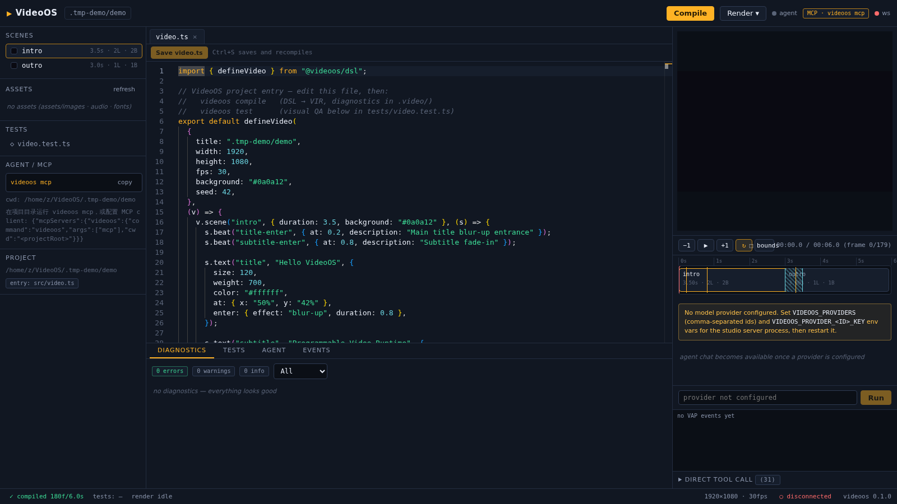

<a id="readme-top"></a>
<div align="center">

# 🎬 VideoOS

### Chat-First Agent Video Studio — 对话式 AI 视频创作工作站 (v0.2)

**对话 → 规划 → DSL → VIR → Frames → Visual QA → MP4**

<a href="https://github.com/AceGuru-mjh/VideoOS/actions/workflows/ci.yml"></a>
<a href="https://github.com/AceGuru-mjh/VideoOS/releases"></a>
<a href="https://github.com/AceGuru-mjh/VideoOS/blob/main/SPEC.md"></a>
<a href="#quickstart"></a>


<a href="./LICENSE"></a>

**一句话看懂**

> **不是「AI + 视频编辑器」，而是对话优先的 Agent 视频工作站：**
> v0.2：对 Agent 说「做一个 30 秒产品介绍视频」→ 全自动 规划→写码→编译→预览→QA→渲染，聊天流内联每一步；
> v0.2.1 Agent 增强包：**38 VAP 工具** · **8 视频模板脚手架** · **34 动效模式库** · 技能配方注入 · DSL 速查 —— 五层脚手架让普通模型也能产出 Opus 级代码视频；
> v0.5 可视化套件：**分析仪表盘**（图层构成/复杂度/调色板/最近活动）· **系统健康面板**（内存双环/MCP/Skills/渲染实时）· **Ctrl+K 命令面板**（编译/渲染/16 主题即选/视图跳转）· **快捷键帮助** · **播放器键盘控制**（Space/←→/L/B）· 图表原语库（10 种 SVG 图表，主题令牌自动适配）；
> 16 主题 · BYO-LLM 9+ 家 · Skills/MCP（28 服务器一键导入 · 139 工具）· **52 技能库** · L1-L4 权限门控 · 五页签可视化面板；IDE 保留为高级模式。

<p>
<b>English</b> · <a href="docs/README.zh-CN.md">简体中文</a>
</p>

</div>

---

## 🔭 一眼看懂

<table>
<tr>
<td align="center" width="33%">

🧬

**VIR — Video IR**

自研视频中间表示：DSL → AST → VIR → Render Graph<br/>多后端中立 · 语义时间线 · 可 diff 的 JSON

</td>
<td align="center" width="33%">

🧪

**Visual Unit Test**

视频第一次拥有 CI：`expect(frame(30)).toContainText("VideoOS")`<br/>golden diff · 溢出检测 · 回归保护

</td>
<td align="center" width="33%">

🤖

**Agent Runtime**

BYO-LLM · Model Router · VAP 工具协议<br/>事务式修改（begin/commit/**rollback**）

</td>
</tr>
</table>

```text
                     ┌─────────────────────────────┐
                     │   Agent (Claude/Codex/GLM)   │
                     └──────────────┬──────────────┘
                                    │ VAP · MCP · CLI · REST
                     ┌──────────────▼──────────────┐
                     │      VideoOS Compiler        │
                     │  DSL → AST → VIR → Graph     │
                     └──────────────┬──────────────┘
                                    │
                     ┌──────────────▼──────────────┐
                     │   Render Runtime + Cache     │
                     │   Canvas/SVG → ffmpeg        │
                     └──────────────┬──────────────┘
                                    │
                     ┌──────────────▼──────────────┐
                     │     Visual QA Engine         │
                     │  PASS → MP4  ·  FAIL → ↺fix  │
                     └─────────────────────────────┘
```

## ✨ 核心特性

| 特性 | 说明 |
|---|---|
| 🧬 **Video DSL** | TypeScript 声明式视频编程：`scene().text().enter().camera()` |
| 📐 **VIR** | 机器可读可 diff 的视频中间表示，语义时间线（场景/节拍命名而非帧号） |
| ⚡ **增量渲染** | Render Graph + 内容寻址缓存（SHA-256）：改一个标题不再重渲整片 |
| 🧪 **Visual Test** | 视频单元测试框架：语义断言免 OCR + 像素级 golden diff |
| 🔍 **Visual Debugger** | 帧元素包围盒 · 溢出红框 · 图层→源码定位 |
| 🤖 **Agent Runtime** | 可插拔模型层（OpenAI 兼容/Anthropic）· Model Router · 动态 Agent 图 |
| 🛠 **VAP 工具协议** | 30+ 结构化工具：compile/render/inspect/test/transaction… |
| 🔌 **MCP Server** | Claude Desktop / Codex / Cursor 直连你的视频项目 |
| ↩️ **事务系统** | Agent 改坏项目自动回滚，告别 `git checkout` |
| 🖥 **Studio IDE** | Monaco + 语义时间线 + 实时预览 + Agent 面板（Windows 桌面应用） |
| 🌐 **中英双语** | Studio 全界面中/英即时切换（词典奇偶校验进 CI）· LLM 回复语言对齐 · 错误码双语映射 → [docs/i18n.md](./docs/i18n.md) |

## 📦 架构

```text
VideoOS/
├── packages/
│   ├── core            # seeded RNG · easing · color · geometry
│   ├── vir             # VIR schema + 语义图（temporal/spatial/dependency）
│   ├── dsl             # 视频 DSL 构建器
│   ├── compiler        # DSL → AST → VIR → RenderGraph + 诊断
│   ├── render-canvas   # 参考渲染后端（@napi-rs/canvas / Skia）
│   ├── render-svg      # SVG 矢量后端
│   ├── cache           # 内容寻址缓存
│   ├── encode          # ffmpeg 编码（MP4/WebM）+ PNG 序列回退
│   ├── qa              # 视觉测试框架
│   ├── workspace       # 项目 FS + 事务（snapshot/rollback）
│   ├── agent           # Agent Runtime + Providers + VAP
│   ├── mcp             # MCP Server（stdio JSON-RPC）
│   └── server          # 本地 API（REST + WS）
├── apps/
│   ├── cli             # videoos 命令行
│   ├── studio          # VideoOS Studio IDE（React）
│   └── desktop         # Electron Windows 壳
├── examples/           # 示例项目
├── skills/             # Agent Skills 库
└── SPEC.md             # 📄 权威规格书（必读）
```

## <a id="quickstart"></a>🚀 Quick Start

### 方式一：Windows 桌面应用（推荐）

从 [**Releases**](https://github.com/AceGuru-mjh/VideoOS/releases) 下载 `VideoOS-Studio-Setup-x.x.x.exe` 安装 —— 内置完整 Studio IDE（Monaco 编辑器 / 实时预览 / 语义时间线 / QA 面板 / Agent 面板）与 bun 视频引擎，开箱即用（最终渲染需系统 ffmpeg，缺失时界面会给出指引，详见 [troubleshooting](docs/troubleshooting.md)）。



### 方式二：源码（bun ≥ 1.3）

```bash
git clone https://github.com/AceGuru-mjh/VideoOS && cd VideoOS
bun install
alias videoos="bun $(pwd)/apps/cli/src/index.ts"   # 下文直接用 videoos

# 创建第一个视频项目
videoos init my-video && cd my-video

# 编译：DSL → VIR
videoos compile

# 渲染：帧缓存 + ffmpeg → MP4
videoos render

# 视觉单元测试
videoos test

# 打开 Studio IDE（本地 server + 浏览器）
videoos preview

# 环境体检（运行时 / ffmpeg / 项目 / providers / 技能库 / MCP 宿主）
videoos doctor

# 浏览 42 个创作技能（对话中 Agent 自动触发）
videoos skills list
videoos skills search lyrics
videoos skills show tech-intro
```

**写一个场景（src/video.ts）：**

```ts
import { defineVideo } from "@videoos/dsl";

export default defineVideo({ title: "Hello", width: 1920, height: 1080, fps: 30 }, (v) => {
  v.scene("intro", { duration: 4 }, (s) => {
    s.beat("title-enter", { at: 0.2 });
    s.text("title", "Hello VideoOS", {
      size: 120, color: "#fff", at: { x: "50%", y: "45%" },
      enter: { effect: "blur-up", duration: 0.8 },
    });
    s.camera("push-in", { from: 1, to: 1.08 });
  });
});
```

**写一个视觉测试（tests/video.test.ts）：**

```ts
import { describe, it, expect, frame } from "@videoos/qa";

describe("intro", () => {
  it("标题在 1 秒可见", () => expect(frame(30)).toContainText("Hello VideoOS"));
  it("无黑帧", () => expect(frame(0)).not.toBeBlack());
});
```

**让外部 Agent（Claude Desktop）直接操作你的项目：**

```jsonc
// claude_desktop_config.json
{ "mcpServers": { "videoos": { "command": "videoos", "args": ["mcp"] } } }
```

## 🧠 Agent 闭环

```text
"做一个 60 秒科技感产品宣传视频"
 ↓ storyboard.plan      → Story Graph → Shot Graph
 ↓ scene 代码生成        → Engineer Agent 写 DSL
 ↓ compile.run          → VIR + 诊断
 ↓ render.preview       → 关键帧检查（缓存命中 <5ms）
 ↓ test.run             → Visual QA
 ↓ FAIL → scene.modify  → 事务内修复（可回滚）
 ↓ PASS → render.final  → MP4
```

## 🗺 Roadmap

- [x] **Phase 1 (v0.1)** — VIR/编译器 · Canvas+SVG 后端 · ffmpeg 编码 · 帧缓存 · Visual QA · Agent Runtime+VAP · MCP · CLI · Studio IDE · Windows 打包
- [ ] **Agent Kit（并行子项目）** — [agent-kit/SPEC.md](./agent-kit/SPEC.md)：24+ 家模型接入（Model Hub）· 本地 MCP 能力套件（fs/shell/web/media/os/assets + host）· 技能库 5→25。独立看板推进，欢迎认领带 `agent-kit` 标签的 Issues
- [ ] **Phase 2** — Remotion/Chromium/Blender 后端 · 多 GPU 调度 · Agent Branch 并行 · 云渲染 · 插件市场

详见 [SPEC.md](./SPEC.md) §14。

## 📚 文档

- [SPEC.md](./SPEC.md) — 权威规格书（VIR Schema / DSL API / VAP 工具清单 / 缓存算法）
- [agent-kit/SPEC.md](./agent-kit/SPEC.md) — Agent Kit 独立子项目规格（模型接入 / 本地 MCP / 技能库）
- [docs/README.zh-CN.md](./docs/README.zh-CN.md) — 中文文档
- [docs/i18n.md](./docs/i18n.md) — i18n 双语指南 / Bilingual i18n guide（架构 · 加字符串流程 · CI 门禁）
- [examples/](./examples/) — 可运行示例
- [skills/](./skills/) — Agent Skills 库

## 🤝 Contributing

PRs welcome! 请先阅读 [SPEC.md](./SPEC.md)，保证实现与规格一致。

## 📄 License

[MIT](./LICENSE) © 2025 AceGuru-mjh

<div align="center">

**VideoOS** — *Make videos programmatically, test them like software.*

</div>
